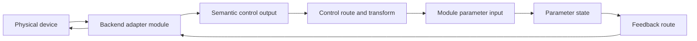

# MusicRaT Roadmap

MusicRaT aims to become a modular, message-driven, real-time audio framework built on CommRaT. The framework should support synthesis, processing, routing, hardware I/O, musical control, and RatGUI-based inspection without allocation or blocking work in the audio path.

The normative signal, port, timing, launcher, and GUI contract is documented in [`docs/SIGNALS_AND_PORTS.md`](docs/SIGNALS_AND_PORTS.md).
File placement, dependency layers, naming, and CMake ownership are documented in [`docs/PROJECT_LAYOUT.md`](docs/PROJECT_LAYOUT.md).
EVL portability, RaTOS packaging, and the layered real-time validation strategy are documented in [`docs/EVL_AND_RATOS.md`](docs/EVL_AND_RATOS.md).
Media decoding, performance playback, recording, and live-device boundaries are documented in [`docs/MEDIA_PLAYBACK.md`](docs/MEDIA_PLAYBACK.md).

## Status

- [x] Complete
- [ ] Planned
- [~] In progress

## Current Baseline

- [x] Central `MusicRaT` application and compile-time message registry
- [x] Bounded planar `AudioBlock` message with explicit stream metadata
- [x] Periodic `Module2` oscillator with typed parameters
- [x] Sine, square, triangle, sawtooth, and reverse-sawtooth generators
- [x] Message-driven oscillator parameters and reset command
- [x] Documented signal domains, port semantics, launcher mapping, and RatGUI graph generation
- [x] Namespaced public headers and domain-oriented source/test layout
- [x] Bounded parameter-event stream, smoothed gain processor, deterministic control source, and null sink
- [x] Typed sample-peak/RMS/clipping telemetry and pass-through level-meter module
- [x] CoreRaT-backed PCM16 WAV sink with bounded block packing and finalized headers
- [x] Router-managed process integration tests and deterministic tone-to-WAV rendering
- [x] Codec-neutral audio file player with runtime decoder probing, bounded decode-ahead, generation-safe seek, and deck controls
- [x] Routed audio-file-player-to-WAV integration with managed router lifecycle
- [~] Automated tests and benchmarks
- [~] Multi-channel audio block contract
- [ ] Audio graph lifecycle and validation
- [ ] Hardware audio, MIDI, and RatGUI integration

## Architecture Principles

All additions should preserve these constraints:

1. Audio processors are CommRaT modules with typed inputs, outputs, and commands.
2. Audio and control messages use bounded, serializable storage.
3. Audio processing performs no allocation, blocking I/O, logging, or exception throwing.
4. Sample rate, channel count, block size, latency, and timestamps are explicit.
5. Parameter changes cross thread boundaries through messages and are smoothed in the audio path when necessary.
6. DSP kernels are independently testable without starting module threads.
7. Modules expose bounded metering and state snapshots for diagnostics and RatGUI.
8. Hardware-specific protocols terminate in adapter modules; DSP modules consume semantic control events rather than device data.
9. Audio, musical events, control values, transport, and telemetry are distinct port domains in the graph.
10. Standard Linux and EVL use the same protocol and DSP code; platform-specific work remains in CommRaT and backend adapters.

## Phase 1: Audio Core

Stabilize the contract that every later module will use.

- [~] Define and stabilize the explicit `AudioBlock` model
  - [x] Use a CMake-selected `float` or `double` sample type (`float` by default)
  - [x] Define CMake-configurable maximum frames and channels at compile time
  - [x] Use planar channel storage
  - [x] Carry sample rate, frame count, channel count, sequence number, and timestamp
  - [x] Define silence, end-of-stream, underrun, discontinuity, and invalid-block flags
  - [ ] Define producer/consumer behavior for every audio flag
- [x] Make oscillator block size derive from sample rate and module period; reject capacity overflow
- [x] Establish `musicrat/musicrat.hpp` as the application-registry umbrella and split protocol definitions by domain
- [x] Define reusable parameter messages and stable module/parameter identifiers
- [~] Define parameter validation, units, ranges, defaults, and smoothing behavior
- [ ] Define stable device, endpoint, control, port, route, and binding identifiers
- [ ] Define transport messages: play, stop, pause, seek, tempo, time signature, and position
- [ ] Define module lifecycle and graph state: configure, prepare, start, suspend, stop, reset
- [ ] Define fan-in, fan-out, backpressure, and dropped-block behavior in CommRaT terms
- [x] Add oscillator timestamp and block sequence tracking
- [x] Migrate the oscillator to CommRaT `Module2`, typed `Output<T>`, `Params<T>`, and `DataWithCommands`
- [x] Build standalone module binaries with `commrat_module()` so complete `*.module.json` descriptors are generated
- [ ] Add reusable real-time utilities
  - Denormal handling
  - [x] Smoothed values and ramps
  - Decibel/linear conversion
  - [x] Audio block validation and channel clearing/metadata copying
  - Lock-free bounded queues where mailbox delivery is not sufficient
- [x] Split public headers into protocol, DSP, module, and utility boundaries
- [x] Add a bounded `ParameterEventBlock` with source, parameter, sample-offset, timestamp, and sequence metadata
- [x] Add a deterministic parameter-event source for graph and synchronization tests

### Phase 1 Exit Criteria

- [ ] Mono and stereo pass-through modules process blocks without allocation
- [x] Invalid format/capacity combinations fail deterministically
- [~] Block continuity, timestamps, and parameter smoothing have automated tests
- [~] A source -> processor -> sink graph runs continuously; sanitizer coverage remains
- [ ] The same graph cross-compiles against the RaTOS SDK and runs under the EVL kernel in QEMU

## CommRaT Launcher Integration

MusicRaT examples and RatGUI must use CommRaT's launcher model rather than inventing a separate graph format. `ProcessLauncher` discovers CMake-generated `*.module.json` descriptors, validates typed routes, writes per-instance `ModuleConfig` files, starts producers before consumers, and can launch RatGUI as a companion process.

### Configuration Mapping

- `modules[].outputs` assigns the `system_id` and `instance_id` for each typed output in descriptor order.
- `modules[].module_address` assigns lifecycle/WORK identity for a module with no outputs.
- `modules[].inputs` connects continuous typed inputs to source output addresses.
- `modules[].synced_inputs` connects secondary inputs sampled alongside the primary input.
- `modules[].remotes` targets another module output for typed command/reply and lifecycle operations.
- `modules[].params` carries module-specific startup parameters into `ModuleConfig::params`.
- `modules[].period_ms` configures timer-driven modules.
- `companions` starts non-CommRaT processes such as RatGUI and passes them the same application description.

Generated descriptors already expose output, input, synchronized-input, and remote types; execution mode; command endpoints; lifecycle endpoints; and default parameters. RatGUI should consume these descriptors as its authoritative catalog of available module classes and compatible connections.

Streaming control signals such as knob motion, gates, note events, and automation should use typed `Output<T>` -> `Input<T>` routes. Infrequent request/reply operations such as reset, preset loading, and device commands should use `DataWithCommands` and `Remote<T>`. This keeps high-rate control data out of synchronous command RPC paths.

### Launcher Work

- [x] Add a generic `musicrat_launcher` using `commrat::ProcessLauncher::main`
- [x] Add `commrat_module()` targets for every independently launchable MusicRaT module
- [x] Keep module descriptor order and launch-config port order deterministic and documented
- [~] Validate duplicate addresses, missing routes, type mismatches, missing remotes, and audio-format compatibility before launch
  - [x] Reject missing or incomplete descriptors and positional output/input/remote cardinality mismatches
  - [x] Reject duplicate typed output addresses, unresolved routes, and payload-type mismatches before spawning
  - [x] Preserve optional trailing synchronized inputs while validating every configured synchronized route
  - [~] Validate audio sample-rate, channel, frame-capacity, and clock-domain compatibility
    - [x] Keep application-specific descriptor metadata opaque to CommRaT and run a MusicRaT-owned preflight callback
    - [x] Validate known direct endpoint sample rates, channel counts, compile-time capacities, and declared clock domains
    - [x] Cover compatible and incompatible oscillator -> WAV sink graphs through generated descriptors
    - [x] Propagate constraints through declared gain and level-meter pass-through relationships
    - [x] Cover compatible and incompatible oscillator -> gain -> level meter -> WAV sink graphs
    - [~] Model format-changing processors and negotiate dynamic hardware/file endpoint formats
      - [x] Represent fixed channel transforms while preserving sample-rate and clock-domain propagation
      - [ ] Negotiate dynamic hardware and file endpoint formats
- [ ] Decide whether production configs use JSON only or whether `ProcessLauncher` should gain the YAML support available in the in-process launcher
- [x] Add schema-versioned stable physical port IDs and labels in MusicRaT descriptor metadata while preserving positional CommRaT routes
- [~] Have the Application Designer edit/save the CommRaT application description and preserve unknown module-specific `params`
- [ ] Have RatGUI launch as a configured `companion`, receiving the same application description path
- [ ] Define safe runtime graph-edit behavior; the current launcher topology is startup-time configuration

### Required Example Launch Configs

- [~] `tone_to_wav.json`: oscillator -> WAV sink is implemented; gain remains to be inserted
- [ ] `tone_to_device.json`: oscillator -> gain -> audio device sink
- [ ] `stereo_channel_strip.json`: stereo source -> EQ -> compressor -> pan/gain -> meter -> sink
- [ ] `mixer.json`: multiple sources -> fixed-capacity mixer -> limiter -> sink
- [ ] `midi_synth.json`: MIDI input -> voice/instrument control input, instrument audio -> sink
- [~] `hardware_control.json`: deterministic control source -> gain exists; hardware adapter, mapper, and feedback remain
- [ ] `ratgui_session.json`: an audio graph plus RatGUI companion and telemetry routes
- [ ] `offline_render.json`: musical/file source -> processing graph -> WAV sink
- [~] Add short-duration CTest smoke runs for every headless launch config
- [ ] Add schema/descriptor validation tests for launch configs that require hardware or RatGUI

## Application Designer Foundation

Stabilize [the application designer architecture](docs/APPLICATION_DESIGNER.md)
before implementing further DSP modules. The implementation remains generic,
while the primary product is a simple visual tool for assembling an audio
application, its hardware and GUI controls, and its presentation surfaces.

- [ ] Define stable IDs for modules, ports, parameters, devices, endpoints, bindings, surfaces, and widgets
  - [x] Add schema-versioned stable IDs and labels for physical module ports
  - [x] Expose `NoteEventBlock` inputs as validated note-domain ports
- [~] Add rich parameter descriptors for control generation, mapping, automation, and display
  - [x] Add IDs, names, groups, kinds, units, ranges, steps, display scales, choices, and automation/read-only flags
  - [x] Publish flat startup parameter metadata for every configurable launchable module, including bounded text-backed paths
  - [ ] Add frequency/custom display mappings and explicit smoothing policy
- [ ] Define bounded semantic control events and parameter-state feedback with origin IDs
- [ ] Define serializable device, endpoint, binding, transform, and surface schemas
- [ ] Implement and test a headless mapping engine independent of GUI and hardware backends
- [ ] Extend project validation and round-trip persistence for bindings and presentation state
- [~] Have the designer directly edit pre-launch CommRaT module and route JSON without an intermediate graph format
  - [x] Add the initial React/TypeScript editor under `tools/application-designer`
  - [x] Import descriptors/configs, validate typed stable-ID edges, and export positional CommRaT routes
  - [x] Generate typed startup parameter controls and preserve edited values through CommRaT JSON export
  - [x] Install descriptors to `${CMAKE_INSTALL_DATADIR}/musicrat/modules`
  - [~] Add an XDG-aware local catalog service, atomic writes, and launcher integration
    - [x] Discover, validate, and serve installed descriptors
    - [ ] Add atomic project writes and launcher lifecycle control
- [ ] Prove one RatGUI surface and one LVGL surface against the same project fixture
- [ ] Prove virtual and simulated hardware knobs can control one gain parameter with feedback

## Phase 2: Essential DSP Modules

Implement the smallest useful processing toolbox. Each item includes its command messages, state snapshot, metering where relevant, DSP tests, and a runnable graph example.

### Utility

- [x] Gain with click-free ramping, mute, and polarity inversion
- [x] Mono-to-stereo panner with selectable linear and equal-power pan laws
- [ ] Channel mapper: mono/stereo conversion, swap, copy, and matrix routing
- [ ] Configurable mono/stereo channel-strip utility
  - Compose the channel mapper, gain, and panner kernels without duplicating DSP
  - Mono-to-stereo panning plus stereo balance and width controls
  - Click-free gain, mute, polarity, bypass, and output metering
  - Explicit input/output channel-format policy for launcher validation
- [ ] DC blocker
- [ ] Delay line and sample-accurate delay compensation
- [ ] Wet/dry mix and bypass with click-free transitions
- [~] Level meter: sample peak, RMS, and clipping implemented; true-peak remains
- [ ] Signal generator: silence, impulse, noise, and test tone

### Filters and EQ

- [ ] Biquad kernel with stable coefficient updates
- [ ] Low-pass, high-pass, band-pass, notch, all-pass, low-shelf, and high-shelf filters
- [ ] Parametric EQ band
- [ ] Multi-band EQ with bounded compile-time maximum band count
- [ ] Filter response data for RatGUI visualization
- [ ] State-variable filter for modulation-heavy use cases

### Dynamics

- [ ] Envelope follower with peak and RMS modes
- [ ] Compressor with threshold, ratio, knee, attack, release, and makeup gain
- [ ] Limiter with documented latency and optional lookahead
- [ ] Noise gate/expander
- [ ] Sidechain input and sidechain filter
- [ ] Gain-reduction metering

### Delay, Modulation, and Spatial Effects

- [ ] Fractional delay kernel with bounded preallocated storage and selectable interpolation
- [ ] Tempo-synchronized mono/stereo delay with feedback, filtering, ping-pong, and ducking
- [ ] Chorus, flanger, and vibrato built from the shared modulated-delay kernel
- [ ] Phaser with selectable stage count and feedback
- [ ] Tremolo, auto-pan, and stereo-width effects
- [ ] Algorithmic reverb with bounded delay storage, damping, predelay, and stereo controls
- [ ] Convolution reverb with non-real-time impulse loading and partitioned processing
- [ ] Click-free bypass, wet/dry control, tail handling, and latency reporting for every effect

### Mixing and Routing

- [ ] Fixed-capacity N-input mixer with configurable mono/stereo inputs and a stereo master bus
- [ ] Preallocated input capacity with runtime activation and stable input identities
- [ ] Per-input gain, pan, mute, solo, and meter state
- [ ] Defined summing headroom, clipping policy, and optional normalization
- [ ] Master bus gain and metering
- [ ] Send/return buses
- [ ] Routing matrix with cycle detection
- [ ] Latency accounting and compensation across parallel paths

## Phase 3: Sources and Instruments

- [ ] Bring the oscillator onto the finalized audio block and parameter contracts
- [ ] Add pulse width, tuning, detune, and anti-aliased oscillator variants
- [ ] Add wavetable oscillator with bounded table storage
- [ ] Add ADSR envelope module
- [ ] Add LFO and modulation messages
- [ ] Add polyphonic voice allocator with note stealing
- [ ] Three-oscillator subtractive synthesizer instrument
  - Per-oscillator waveform, octave, semitone, fine tuning, phase, level, and enable controls
  - Oscillator sync, detune/unison, noise source, and bounded internal mixing
  - Multimode filter with dedicated envelope and keyboard tracking
  - Amp ADSR, filter ADSR, LFOs, velocity response, and bounded modulation routing
  - Polyphonic voice allocation, sustain handling, and deterministic voice stealing
- [ ] Complete wavetable synthesizer instrument
  - Band-limited table banks, interpolation, wavetable position, and table morphing
  - Non-real-time wavetable loading and validation with bounded real-time state
  - Per-voice envelopes, filters, LFOs, unison, and modulation routing
  - Polyphonic note and per-note expression support through `NoteEventBlock`
- [ ] Add sampler with non-real-time loading and preallocated playback voices
- [ ] Add metronome and clock source
- [~] Add codec-neutral file player following `docs/MEDIA_PLAYBACK.md`
  - [x] Codec-neutral decoder, decode-ahead, and playback coordinator contracts
  - [x] Launchable codec-neutral `Module2` player and typed deck-control source
  - [x] Runtime codec probing and backend selection
  - [x] Bounded playback render-status telemetry
  - [x] Worker state, codec/source metadata, duration, and resident-frame telemetry
  - [x] Detailed decoder error codes and buffered media-range telemetry
  - [x] PCM WAV reader and bounded decode-ahead pool
    - [x] Bounded PCM16 RIFF reader with metadata, seeking, and chunk validation
    - [x] Preallocated decode-ahead pool and worker handoff
  - [x] Optional libFLAC decoder with CoreRaT file callbacks, seeking, and routed playback coverage
  - [x] Optional libmpg123 decoder with CoreRaT file callbacks, seeking, and routed playback coverage
  - [x] Optional FFmpeg AAC and Opus decoders with CoreRaT file callbacks, seeking, and routed playback coverage
  - [x] Generation-safe asynchronous load and seek
    - [x] Worker/real-time transition coordinator with stale-lease suspension
    - [x] Player module commands and managed decoder-worker scheduling
  - [x] Forward varispeed with smoothed rate changes
    - [x] Allocation-free chunk renderer with linear interpolation
    - [x] Generation rejection, pause, underrun, and end-of-stream behavior
    - [x] Decode-ahead coordinator and timestamped deck-control integration
  - [x] End-of-stream, discontinuity, and underrun rendering behavior
  - [x] Sample-offset cue points and bounded resident-window loop behavior
  - [~] Pitch-lock time stretching with declared latency and rate range
    - [x] Optional Rubber Band real-time processor with bounded block storage
    - [x] Player mode, supported-rate, and algorithmic-latency telemetry
    - [x] Native and routed pitch-lock playback coverage
    - [x] Sample-offset inverse-pitch automation
    - [ ] EVL runtime validation
  - [x] Beat-grid metadata and transport master/follower synchronization
    - [x] Bounded tempo-segment metadata and musical-time mapping
    - [x] Launchable graph transport master with tempo, meter, position, and play state
    - [x] Player tempo/phase following with bounded nudges and generation-safe seeks
    - [x] Sync diagnostics and routed master/follower playback coverage
    - [x] Quantized cue, loop, and start actions
- [ ] Define MusicXML-to-event conversion after transport and note-event semantics stabilize

## External Control Architecture

External control should be represented independently of MIDI, HID, OSC, GPIO, or a specific controller. A backend adapter owns device discovery and protocol parsing, then publishes semantic events that can be routed to module parameters. DSP modules never need to know which physical device originated a change.

### Control Domains

Use a small, explicit set of typed port domains so RatGUI can permit valid connections and explain invalid ones:

- **Audio:** continuous sample blocks; routable only to audio ports
- **Note:** note, velocity, pressure, and note-expression events
- **Control:** normalized unipolar/bipolar values and discrete choices
- **Gate/trigger:** edges and held boolean state
- **Transport:** tempo, position, play state, and clock events
- **Telemetry:** meters, waveforms, status, and other read-only snapshots

Raw protocol packets may be exposed by diagnostics, but normal graph routing should use these semantic domains. Do not collapse every domain into an untyped numeric message.

### Device and Endpoint Model

- [ ] Define a serializable `DeviceDescriptor`: stable ID, display name, backend, capabilities, connection state, and optional vendor/product identity
- [ ] Define bounded input/output endpoint descriptors with stable IDs, names, event type, direction, and value metadata
- [ ] Define device lifecycle events: discovered, connected, disconnected, changed, and error
- [ ] Preserve bindings while hardware is disconnected and restore them when the stable device identity returns
- [ ] Define fallback identity and user confirmation for devices without reliable serial numbers
- [ ] Keep device enumeration, parsing, and reconnect work off the audio thread

### Semantic Events and Parameters

- [ ] Define timestamped POD event messages for continuous, bipolar, discrete, gate, trigger, note, and transport values
- [ ] Carry source endpoint ID, sequence number, timestamp, and value in each event
- [ ] Define a `ParameterDescriptor`: stable ID, name, unit, type, range, default, step, display mapping, and automation capability
- [ ] Let modules expose typed control input ports separately from their command mailbox
- [ ] Convert control timestamps into sample offsets when events affect an audio block
- [ ] Define event ordering, duplicate suppression, overflow behavior, and late-event policy
- [ ] Avoid registry growth per physical knob by routing endpoint IDs in bounded event messages

### Bindings and Transforms

A binding is persistent graph data from one control endpoint to one target parameter, not hidden state inside either module.

- [ ] Define source endpoint -> target parameter bindings with stable route IDs
- [ ] Support range scaling, inversion, offset, dead zone, response curves, quantization, and hysteresis
- [ ] Support absolute, relative encoder, toggle, momentary, trigger, and increment/decrement modes
- [ ] Support pickup/soft-takeover modes to prevent parameter jumps
- [ ] Allow one-to-many mappings and define how multiple sources arbitrate one parameter
- [ ] Put smoothing at the parameter boundary; keep mapping transforms deterministic
- [ ] Support conditional mappings such as modifier buttons, banks, pages, and MIDI channels
- [ ] Support bidirectional feedback for LEDs, displays, and motorized controls without feedback loops
- [ ] Persist mappings independently from transient device connection state

### Graphical Routing

- [ ] Represent devices as graph nodes with named, typed endpoint ports
- [ ] Represent module parameters as connectable control ports without cluttering the default audio graph
- [ ] Provide audio, note, control, transport, and telemetry layers or filters in RatGUI
- [ ] Use domain-specific port styling and show compatibility before a connection is made
- [ ] Insert an editable mapping node when a route needs scaling, curves, gating, or mode conversion
- [ ] Add control-learn mode: select a target, move hardware, preview the mapping, then confirm
- [ ] Show live values, event activity, clipping/out-of-range state, connection health, and the effective transformed value
- [ ] Clearly display missing hardware while retaining its routes and settings
- [ ] Make route creation, deletion, and mapping edits undoable and session-persistent
- [ ] Provide a compact performance view for chosen controls in addition to the full graph editor

## Phase 4: Control Hardware, Keyboard, and MIDI

- [x] Define bounded, timestamped semantic note events independent of MIDI and MusicXML
- [ ] Define timestamped musical event messages
  - Note on/off and polyphonic pressure
  - Control change, pitch bend, program change, and channel pressure
  - Clock, start, continue, stop, and song position
- [ ] Computer-keyboard source with configurable note mapping, octave, velocity, and key-repeat suppression
- [ ] MIDI input source with device enumeration, connection state, and hot-plug handling
- [ ] MIDI output sink
- [ ] MIDI adapter from protocol messages to semantic note, control, gate, and transport events
- [ ] MIDI feedback adapter for controller LEDs, displays, and motorized controls
- [ ] MIDI channel filtering and mapping through the shared binding model
- [ ] Sample-accurate event placement within audio blocks
- [ ] Sustain pedal and stuck-note recovery
- [ ] Generic HID/game-controller adapter
- [ ] OSC network adapter with bounded address and payload handling
- [ ] Optional GPIO/control-voltage adapters where supported by the target platform
- [ ] Optional MIDI 2.0/UMP investigation after MIDI 1.0 is stable

## Phase 5: Audio I/O and Sinks

Keep backend callbacks minimal: adapt buffers, transfer bounded data, update counters, and return.

- [ ] Select the first backend and document platform scope
  - Candidates: JACK/PipeWire for Linux-first development, ALSA for direct access, RtAudio or miniaudio for portability
- [ ] Audio device enumeration and capability reporting
- [ ] Audio output sink with format negotiation and channel mapping
- [ ] Audio input source
- [ ] Full-duplex operation
- [ ] Bounded buffering between CommRaT scheduling and the device callback
- [ ] Underrun/overrun detection, counters, and recovery policy
- [ ] Device hot-plug and sample-rate/block-size change handling
- [~] WAV file I/O for deterministic tests and offline rendering
  - [x] PCM16 WAV sink backed by `corerat::File`
  - [x] Byte-exact writer and lifecycle tests
  - [x] Process-level tone render verification
  - [x] PCM WAV source through the launchable codec-neutral audio file player
- [ ] Codec-aware file sinks with bounded PCM handoff to in-band encoder workers
- [ ] Explicit recording overflow policy and queue/error telemetry
- [x] Null sink for tests, benchmarks, and headless graphs
- [ ] End-to-end latency measurement

## Phase 6: RatGUI and LVGL Visualization and Control

Both renderers consume the shared project, surface schema, snapshots, and commands. Neither may read mutable DSP state directly or block the audio path. RatGUI is the full application/graph designer; LVGL is initially the efficient on-device performance and status surface.

- [ ] Confirm RatGUI APIs, threading model, rendering backend, and dependency integration
- [ ] Confirm LVGL version, display/input drivers, threading boundary, and RaTOS integration
- [ ] Implement shared renderer-neutral surface loading and capability validation
- [ ] Define bounded UI snapshot messages and configurable publication rates
- [ ] Module browser with lifecycle and health state
- [ ] Graph view with typed ports, connections, and validation feedback
- [ ] Shared parameter controls with units, ranges, defaults, and automation indication
- [ ] External-device browser, binding editor, control learn, and feedback configuration
- [ ] Oscilloscope with decimated waveform snapshots
- [ ] Spectrum analyzer with FFT performed outside the audio callback
- [ ] Peak/RMS meters and clipping indicators
- [ ] Filter/EQ response editor and visualization
- [ ] Compressor transfer curve, envelope, and gain-reduction views
- [ ] Mixer strips with gain, pan, mute, solo, routing, and meters
- [ ] Piano keyboard and MIDI activity monitor
- [ ] Audio/MIDI device settings and diagnostics
- [ ] Persist and restore graph layout and module settings

## Phase 7: Graph, Sessions, and Automation

- [ ] Declarative graph description with stable module and connection IDs
- [ ] Validate type compatibility, cycles, required inputs, formats, and capacities before start
- [ ] Deterministic graph startup and shutdown ordering
- [ ] Graph edits through commands with safe handoff at block boundaries
- [ ] Session save/load with schema versioning and migration
- [ ] Presets for modules and complete graphs
- [ ] Parameter automation lanes with sample-accurate events
- [ ] Tempo-synchronized parameters and musical-time conversion
- [ ] Undo/redo for GUI graph and parameter edits
- [ ] Offline render mode

## Phase 8: Quality and Distribution

### Testing

- [x] Add a test framework and CTest integration
- [ ] Unit-test every DSP kernel with silence, impulse, DC, sine sweep, and boundary values
- [ ] Verify filter response, EQ gain, dynamics curves, and mixer summing numerically
- [ ] Add message serialization and registry tests
- [x] Add threaded module lifecycle and graph integration tests
- [~] Add WAV golden-file tests with explicit tolerances; PCM16 byte-exact and render checks exist
- [ ] Run AddressSanitizer, UndefinedBehaviorSanitizer, and ThreadSanitizer jobs
- [ ] Add long-running stress tests for dropouts, leaks, races, and queue saturation
- [ ] Add real-time checks that detect allocation and blocking operations in processing paths

### EVL and RaTOS

- [ ] Add MusicRaT `evl` and `evl-cross` CMake presets aligned with CommRaT
- [ ] Adapt CommRaT's EVL development helper for SDK acquisition, deployment, tests, and in-guest descriptor generation
- [ ] Cross-compile every module, test, and application against the pinned RaTOS ISAR SDK
- [ ] Run CTest and the controlled source -> processor -> sink graph under the EVL kernel in QEMU
- [ ] Add a RaTOS `musicrat_git.bb` package recipe, `ratos-musicrat-image`, and matching KAS target
- [ ] Boot-test installed MusicRaT examples without source-tree or build-tree dependencies
- [ ] Add physical-target audio stress tests for underruns, worst-case processing time, latency, and jitter
- [ ] Publish a compatibility matrix keyed by MusicRaT, CommRaT, RaTOS, kernel, board, and audio backend versions

### Performance

- [ ] Benchmark per-module CPU cost, graph throughput, and message overhead
- [ ] Track worst-case callback time, not only average time
- [ ] Measure end-to-end latency and jitter
- [ ] Add SIMD only after profiling identifies stable hot paths
- [ ] Establish supported limits for channels, block size, modules, mixer inputs, and sample rate

### Project Delivery

- [ ] Add README with build, run, architecture, and first-patch instructions
- [ ] Export a consumable CMake library target instead of only demo executables
- [ ] Add install rules for headers, targets, and package configuration
- [ ] Add CI for supported compilers and configurations
- [ ] Generate API documentation and module authoring guide
- [ ] Add complete examples: synthesizer, EQ strip, mixer, MIDI instrument, and headless render
- [ ] Define versioning and compatibility policy for messages and session files

## Proposed Releases

### v0.1 - Audio Core

- Final audio block contract
- Real-time utilities and test harness
- Gain, pan, meter, pass-through, null sink, and WAV sink
- One tested source -> process -> sink example

### v0.2 - Processing Channel

- Filter and parametric EQ
- Compressor and limiter
- Mixer with metering
- Latency reporting

### v0.3 - Playable Instrument

- MIDI and computer-keyboard input
- Oscillator, envelope, and polyphonic voice allocation
- First hardware audio output backend

### v0.4 - RatGUI

- Module graph and parameter controls
- Scope, spectrum, EQ, dynamics, and mixer visualizations
- Device configuration and diagnostics

### v0.5 - Sessions

- Save/load, presets, graph editing, automation, and offline rendering
- Broader platform and backend support

### v1.0 - Supported Framework

- Stable public module and message APIs
- Documented real-time guarantees and supported limits
- Complete CI, stress, performance, and compatibility test coverage
- Production examples and module authoring documentation

## Decisions Needed

Record decisions here before their dependent phase begins.

| Decision | Initial direction | Status |
| --- | --- | --- |
| Internal sample type | CMake-selected `float` or `double`; default `float` | Decided |
| Channel storage | Planar fixed-capacity block | Decided |
| Audio capacities | CMake-generated application-wide constants | Decided |
| Scheduling model | Fixed-size processing quantum synchronized to the audio device | Open |
| Media decode boundary | In-band decoder worker feeding preallocated PCM chunks to the real-time renderer | Decided |
| Initial player rate mode | Forward varispeed first; pitch lock as a latency-reporting extension | Decided |
| Deck synchronization | One graph transport master with explicit follower tempo/phase modes | Proposed |
| Compressed recording | Bounded PCM handoff to an in-band encoder worker | Decided |
| First audio backend | JACK/PipeWire on Linux | Open |
| Portable audio backend | Evaluate RtAudio and miniaudio | Open |
| MIDI backend | Evaluate ALSA sequencer and a portable abstraction | Open |
| External control representation | Semantic typed events plus persistent parameter bindings | Proposed |
| Device identity | Backend ID plus vendor/product/serial identity where available | Open |
| Control timing | Monotonic timestamps converted to in-block sample offsets | Proposed |
| Parameter arbitration | Explicit policy per target when multiple routes write | Open |
| RatGUI integration | Snapshot messages plus command messages | Open |
| Plugin formats | Defer until standalone graph and API are stable | Deferred |

## Module Definition of Done

A module is complete when it:

- [ ] Uses registered typed messages for all external control and data flow
- [ ] Has bounded memory and performs no allocation or blocking work while processing audio
- [ ] Validates configuration and defines invalid-input behavior
- [ ] Handles reset, bypass, silence, discontinuity, and sample-rate changes where applicable
- [ ] Smooths audible parameter changes where applicable
- [ ] Reports latency, health, and bounded GUI/diagnostic state where applicable
- [ ] Has DSP unit tests, module integration tests, and a runnable example
- [ ] Documents parameters, units, ranges, defaults, channel behavior, and latency
- [ ] Cross-compiles for EVL; execution, messaging, lifecycle, and backend changes also pass EVL QEMU tests