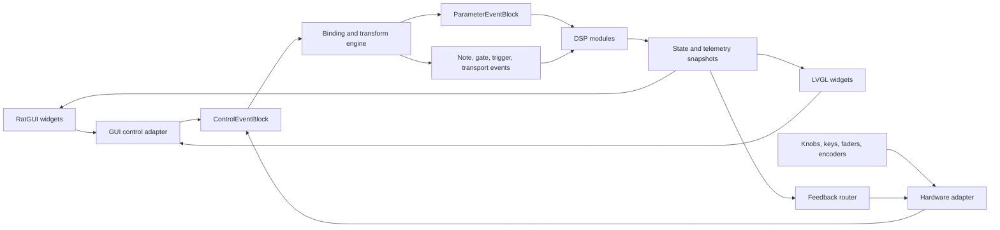

# Application Designer, Control Surfaces, and Presentation Architecture

## 1. Purpose and Status

This document defines how users visually assemble MusicRaT applications from
audio modules, hardware controls, GUI controls, mappings, and presentation
surfaces. It is normative for future RatGUI, LVGL, device-adapter, binding, and
project-schema work.

The implementation must remain generic underneath while presenting a simple
application-design tool. A user should be able to place useful components,
connect compatible ports, assign a knob or GUI control to a parameter, choose a
device, validate the design, and run it without understanding CommRaT mailbox
addresses or message serialization.

Version 1 edits startup-time topology. Parameters and predeclared control routes
may operate while the application runs, but adding modules or changing physical
routes requires validation and relaunch. Live topology changes remain deferred
until an atomic runtime reconfiguration protocol exists.

## 2. Design Principles

1. The project document is authoritative. RatGUI, LVGL, and command-line tools
   read and write the same pre-launch application model.
2. Do not introduce a second MusicRaT graph. The `modules` and `companions`
   sections are the CommRaT application description, and generated module
   descriptors are the authoritative type catalog.
3. Hardware controls and GUI controls are logical control endpoints with the
   same semantic event contract.
4. DSP modules consume parameter, note, gate, trigger, and transport events.
   They never depend on RatGUI, LVGL, MIDI, HID, GPIO, or widget classes.
5. Presentation state is separate from DSP state and routing state. Multiple
   surfaces may present and control one running application.
6. Telemetry is bounded, rate-limited, and lossy. Control edges follow explicit
   delivery and overflow policies and never travel through telemetry.
7. Stable IDs, not display names or array positions, connect persisted objects.
8. The simple path should require few decisions; advanced transforms and routing
   remain available without cluttering the default view.

## 3. User-Facing Model

The application designer presents one project through focused layers rather
than exposing every implementation detail at once:

- **Audio:** sources, instruments, processors, mixers, and sinks.
- **Notes and transport:** keyboards, sequencers, clocks, and note-aware modules.
- **Controls:** hardware endpoints, GUI controls, mappings, and parameter targets.
- **Telemetry:** meters, scopes, spectra, status, and diagnostics.
- **Surfaces:** RatGUI pages and on-device LVGL screens.

The default workflow is:

1. Add a source or instrument, processors, and an audio sink.
2. Connect visible compatible audio ports.
3. Select a module parameter and choose **Add control** or **Learn control**.
4. Move a hardware control or place a GUI widget.
5. Accept the inferred binding, then optionally edit range, curve, pickup, or
   feedback behavior.
6. Choose which controls and telemetry appear on each RatGUI or LVGL surface.
7. Validate, save, and launch.

Advanced users may reveal all domains, mapping nodes, addresses, clock domains,
latency, and unresolved devices. The underlying project is identical in both
views.

## 4. Architectural Model



### 4.1 CommRaT Application Graph

Before launch, the designer directly creates and edits CommRaT `Module2`
instances, parameters, companions, and physical routes in the project JSON.
There is no separate intermediate graph and no topology construction after the
application starts. The designer hides generated addresses and positional port
arrays during normal editing, then fills and validates those mechanical fields
deterministically before save or launch.

### 4.2 Physical Typed Ports

Generated module descriptors expose stable MusicRaT metadata for each physical
CommRaT port that should appear in the designer. Each entry maps a stable ID and
display name to one exact descriptor direction and positional index, declares a
semantic domain, and states whether the route is required. The CommRaT payload
type remains the compatibility authority.

The initial domains are audio, note, control, parameter, transport, telemetry,
and command. An `Input<NoteEventBlock>` is therefore a first-class note-domain
port, not a GUI convention inferred from a module name. Metadata validation
rejects duplicate IDs, duplicate physical positions, invalid indices, and known
payload/domain mismatches before launch.

### 4.3 Logical Endpoints

A logical endpoint is a control source or feedback target. Examples include an
LVGL slider, a RatGUI rotary control, a MIDI encoder, a GPIO potentiometer, a
computer key, an LED, and a motorized fader.

Every endpoint has:

- Stable endpoint ID and owning device or surface ID
- Direction: input, output, or bidirectional
- Domain: unipolar, bipolar, relative, boolean, choice, gate, trigger, note,
  transport, text, or telemetry
- Value range, resolution, labels, and optional unit
- Capabilities such as touch gesture, relative encoding, feedback, color, text,
  or motor position
- Connection and availability state

GUI widgets do not become individual CommRaT modules or mailboxes. Each GUI
process is an adapter that batches widget events by endpoint ID. Hardware
backends do the same for physical controls.

### 4.4 Virtual Parameter Ports

Generated parameter metadata exposes module parameters as virtual control
targets. A virtual port has a stable parameter ID and canonical parameter name,
display name and group, value kind, unit, range, step, display mapping, choices,
and automation/read-only flags. Its startup default remains authoritative in
the descriptor's `params_defaults`. Many virtual ports share one bounded
physical `ParameterEventBlock` input.

The `text` kind covers bounded string-backed startup settings such as media and
output paths. Nested aggregates such as `BeatGrid` remain outside the initial
editor contract.

### 4.5 Bindings and Mapping

A binding connects one logical source endpoint to a module parameter or another
semantic target. It stores:

- Stable binding ID, source endpoint ID, and target ID
- Absolute, relative, toggle, momentary, gate, trigger, or choice mode
- Scale, offset, inversion, dead zone, curve, quantization, and hysteresis
- Pickup or soft-takeover policy
- Optional modifier, bank, page, MIDI-channel, or condition rules
- Arbitration priority for targets with multiple writers
- Optional feedback destination and loop-suppression origin ID

The mapping engine is independent of every GUI and hardware backend. It converts
semantic controls to target-oriented events and applies deterministic ordering,
coalescing, overflow, and late-event policies. Parameter smoothing remains at
the target boundary.

## 5. Project Document

The project is one schema-versioned document. It extends the existing CommRaT
application description without replacing its module and routing semantics.
Unknown fields must survive load/save round trips.

Conceptually it contains:

```json
{
  "schema_version": 1,
  "app_name": "PerformanceRig",
  "modules": [],
  "companions": [],
  "devices": [],
  "bindings": [],
  "surfaces": [],
  "designer": {}
}
```

- `modules` and `companions` retain CommRaT launch semantics.
- `devices` stores desired adapters, stable identities, and unresolved-device
  state, never transient device handles.
- `bindings` stores endpoint-to-target routing and transforms.
- `surfaces` stores renderer-neutral pages and widgets.
- `designer` stores graph coordinates, collapsed groups, visible layers, and
  other editor-only state.

Launched adapters receive only the sections they own. DSP modules do not parse
the complete project document.

## 6. Presentation Surfaces

A surface is a renderer-neutral control and visualization layout. It references
stable endpoints, parameters, bindings, commands, and telemetry streams rather
than C++ objects.

A surface contains:

- Stable surface ID, name, target class, and optional device constraints
- Pages, groups, grid/layout constraints, navigation, and visibility conditions
- Controls: knob, slider, fader, button, toggle, choice, XY control, keyboard,
  transport, and text input
- Displays: value, status, meter, waveform, spectrum, response curve, and list
- Explicit bindings or automatically generated controls from parameter metadata
- Theme tokens and semantic sizes rather than renderer-specific drawing code

RatGUI may provide the full graph editor, rich visualization, and responsive
desktop/tablet layouts. LVGL initially targets deterministic on-device pages,
performance controls, meters, device state, and control learn. Both consume the
same surface schema but may reject unsupported widget capabilities explicitly.

The schema describes intent, not pixels. Renderer-specific overrides are
allowed under namespaced optional fields and must not alter control semantics.

## 7. Feedback and State Ownership

Persistent parameter values belong to module parameters. Widget state is a
projection of parameter state, binding state, device state, and telemetry.

- A control gesture emits a semantic event with endpoint and origin IDs.
- The mapping engine emits the resulting target event.
- The target publishes bounded parameter-state feedback at a controlled rate.
- GUI adapters and hardware feedback adapters update matching endpoints.
- Origin IDs or equivalent suppression state prevent feedback loops.
- A disconnected surface or device may reconnect and request a current snapshot.

Optimistic widget movement is allowed for responsiveness, but authoritative
state comes back through the feedback path. Meter and scope updates may be
dropped; note edges, commands, and committed parameter changes require explicit
delivery policies.

## 8. Designer Preparation and Validation

Before save or launch, the designer:

1. Loads generated module descriptors and adapter capabilities.
2. Resolves stable IDs and verifies references.
3. Allocates CommRaT output addresses and positional routes deterministically.
4. Writes binding, mapping-engine, device-adapter, and surface configuration into
   their owned project sections.
5. Validates payload domains, cardinality, audio formats, clock domains, cycles,
   capacities, parameter ranges, and required devices.
6. Validates each surface against renderer and endpoint capabilities.
7. Reports errors on the relevant node, cable, binding, widget, or device.
8. Writes the project JSON atomically and launches it through `ProcessLauncher`.

`ProcessLauncher` receives the same module and routing data the user designed;
the preparation step does not translate a MusicRaT graph into a different
CommRaT graph. It only supplies fields that the visual editor intentionally
hides and configures the adapters that implement declared bindings and surfaces.

Disconnected optional hardware is a warning and retains its bindings. Missing
required audio devices, incompatible routes, duplicate IDs, or unsupported
surface capabilities are errors unless an explicit fallback is configured.

## 9. Simplicity Rules

- Offer templates such as tone-to-device, channel strip, mixer, MIDI instrument,
  and hardware-controlled effect.
- Auto-create sensible mapping nodes and hide them until advanced editing is
  requested.
- Generate a suitable widget from parameter metadata, while allowing replacement.
- Show only compatible connection targets during cable creation.
- Keep audio, control, note, transport, and telemetry cables visually distinct.
- Support control learn as a first-class workflow.
- Preserve missing devices and explain how to reconnect or substitute them.
- Keep generated addresses, serialization types, and descriptor order out of the
  normal user workflow.

## 10. Implementation Sequence

This architecture should be stabilized before broad DSP, hardware, or GUI work:

1. Define stable ID types and rich `ParameterDescriptor` metadata.
2. Define bounded `ControlEventBlock`, parameter-state feedback, and device/
   endpoint descriptors.
3. Define and test the serializable binding/transform schema.
4. Implement a headless mapping engine with virtual GUI and hardware endpoints.
5. Extend project parsing, validation, and round-trip preservation for devices,
   bindings, surfaces, and designer state.
6. Define the renderer-neutral surface schema and capability negotiation.
7. Prototype one RatGUI page and one LVGL page against the same project fixture.
8. Add a visual graph editor and application templates after preparation and
   validation are deterministic.

The first executable proof should route both a virtual GUI knob and a simulated
hardware knob through the same mapping engine to `MusicRaTGain`, publish feedback
to both endpoints, persist the project, reload it, and preserve the same
launch-ready CommRaT application graph.

### 10.1 Initial Browser Prototype

`tools/application-designer` contains the initial TypeScript/React application.
It loads generated module descriptors and CommRaT application JSON through file
pickers, renders physical ports from `musicrat_ports`, exposes startup controls
from `musicrat_parameters`, validates domain and payload compatibility, and
exports positional CommRaT routes. Its framework-independent graph compiler is
covered by unit tests, including semantic note routing.

The built-in note-aware catalog is a design fixture until launchable note-source
and instrument modules exist. The local host now provides automatic installed
descriptor discovery. Atomic project writes and process launch remain future
host capabilities.

### 10.2 Installed Descriptor Discovery

Production discovery uses installed artifacts rather than a CMake build tree.
`cmake --install` places module executables in
`${CMAKE_INSTALL_BINDIR}` and generated `*.module.json` descriptors in
`${CMAKE_INSTALL_DATADIR}/musicrat/modules`. The local designer host will expose
the resulting catalog to the browser frontend. Installed descriptors are
rewritten to reference their installed executable paths.

The host searches descriptor directories in this order:

1. The colon-separated `MUSICRAT_MODULE_PATH`, for development and explicit
   deployment overrides.
2. `$XDG_DATA_HOME/musicrat/modules`, when `XDG_DATA_HOME` is set.
3. Each `$XDG_DATA_DIRS` entry followed by `/musicrat/modules`.
4. MusicRaT's configured installation data directory as the final fallback.

Later entries with a duplicate `module_class` are ignored. A descriptor is only
published to the frontend after schema validation and after its referenced
module binary is present. Build-directory selection remains an explicit
development override and is never a production default.

## 11. Non-Goals for the First Version

- Arbitrary live module creation, deletion, or physical rewiring
- Renderer-specific DSP APIs or direct access to mutable module state
- One CommRaT module or message type per widget or physical control
- Raw MIDI, HID, GPIO, or LVGL events entering DSP modules
- Pixel-identical RatGUI and LVGL layouts
- A second graph format that bypasses CommRaT descriptors or `ProcessLauncher`