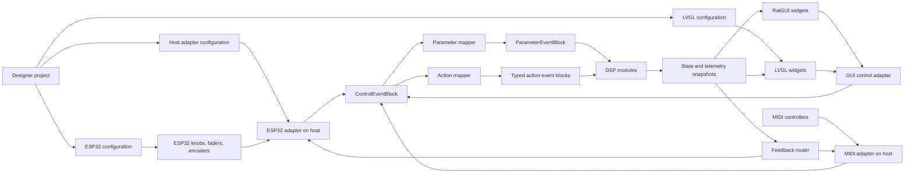

# Application Designer, Control Surfaces, and Presentation Architecture

## 1. Purpose and Status

This document defines how users visually assemble MusicRaT applications from
audio modules, hardware controls, GUI controls, mappings, and presentation
surfaces. It is normative for future RatGUI, LVGL, device-adapter, binding, and
project-schema work.

The implementation must remain generic underneath while presenting a simple
application-design tool. A user should be able to place useful components,
connect compatible ports, assign a knob or GUI control to a parameter, choose a
device, validate the design, and run it without understanding CommRaT mailbox
addresses or message serialization.

Version 1 edits startup-time topology. Parameters and predeclared control routes
may operate while the application runs, but adding modules or changing physical
routes requires validation and relaunch. Live topology changes remain deferred
until an atomic runtime reconfiguration protocol exists.

## 2. Design Principles

1. The project document is authoritative. RatGUI, LVGL, and command-line tools
   read and write the same pre-launch application model.
2. Do not introduce a second MusicRaT graph. The `modules` and `companions`
   sections are the CommRaT application description, and generated module
   descriptors are the authoritative type catalog.
3. Hardware controls and GUI controls are logical control endpoints with the
   same semantic event contract.
4. DSP modules consume parameter, note, gate, trigger, and transport events.
   They never depend on RatGUI, LVGL, MIDI, HID, GPIO, or widget classes.
5. Presentation state is separate from DSP state and routing state. Multiple
   surfaces may present and control one running application.
6. Telemetry is bounded, rate-limited, and lossy. Control edges follow explicit
   delivery and overflow policies and never travel through telemetry.
7. Stable IDs, not display names or array positions, connect persisted objects.
8. The simple path should require few decisions; advanced transforms and routing
   remain available without cluttering the default view.
9. The project is the single editable source for placed deck components,
   labels, geometry, presentation, and application bindings. Component catalogs
   define fixed dimensions and semantic capabilities. Devices, endpoints,
   surfaces, ESP32/host configuration, and future manufacturing files are
   derived artifacts rather than parallel user-authored models.

## 3. User-Facing Model

The application designer presents one project through focused layers rather
than exposing every implementation detail at once:

- **Audio:** sources, instruments, processors, mixers, and sinks.
- **Notes and transport:** keyboards, sequencers, clocks, and note-aware modules.
- **Controls:** hardware endpoints, GUI controls, mappings, and parameter targets.
- **Telemetry:** meters, scopes, spectra, status, and diagnostics.
- **Surfaces:** RatGUI pages and on-device LVGL screens.

The default workflow is:

1. Add a source or instrument, processors, and an audio sink.
2. Connect visible compatible audio ports.
3. Select a module parameter and choose **Add control** or **Learn control**.
4. Move a hardware control or place a GUI widget.
5. Accept the inferred binding, then optionally edit range, curve, pickup, or
   feedback behavior.
6. Choose which controls and telemetry appear on each RatGUI or LVGL surface.
7. Validate, save, and launch.

Advanced users may reveal all domains, mapping nodes, addresses, clock domains,
latency, and unresolved devices. The underlying project is identical in both
views.

## 4. Architectural Model


```mermaid
flowchart LR
   Project[Designer project] --> ESPConfig[ESP32 configuration]
   Project --> HostConfig[Host adapter configuration]
   Project --> LVGLConfig[LVGL configuration]
    RatGUI[RatGUI widgets] --> UIAdapter[GUI control adapter]
   LVGLConfig --> LVGL[LVGL widgets]
   LVGL --> UIAdapter
   ESPConfig --> ESP32[ESP32 knobs, faders, encoders]
   HostConfig --> ESPAdapter[ESP32 adapter on host]
   ESP32 --> ESPAdapter
   MIDI[MIDI controllers] --> MIDIAdapter[MIDI adapter on host]
    UIAdapter --> Controls[ControlEventBlock]
   ESPAdapter --> Controls
   MIDIAdapter --> Controls
   Controls --> ParameterMapper[Parameter mapper]
   Controls --> ActionMapper[Action mapper]
   ParameterMapper --> Parameters[ParameterEventBlock]
   ActionMapper --> Actions[Typed action event blocks]
    Parameters --> Modules[DSP modules]
   Actions --> Modules
    Modules --> Telemetry[State and telemetry snapshots]
    Telemetry --> RatGUI
    Telemetry --> LVGL
    Telemetry --> Feedback[Feedback router]
   Feedback --> ESPAdapter
   Feedback --> MIDIAdapter
```

### 4.1 CommRaT Application Graph

Before launch, the designer directly creates and edits CommRaT `Module2`
instances, parameters, companions, and physical routes in the project JSON.
There is no separate intermediate graph and no topology construction after the
application starts. The designer hides generated addresses and positional port
arrays during normal editing, then fills and validates those mechanical fields
deterministically before save or launch.

### 4.2 Physical Typed Ports

Generated module descriptors expose stable MusicRaT metadata for each physical
CommRaT port that should appear in the designer. Each entry maps a stable ID and
display name to one exact descriptor direction and positional index, declares a
semantic domain, and states whether the route is required. The CommRaT payload
type remains the compatibility authority.

The initial domains are audio, note, control, parameter, transport, telemetry,
and command. An `Input<NoteEventBlock>` is therefore a first-class note-domain
port, not a GUI convention inferred from a module name. Metadata validation
rejects duplicate IDs, duplicate physical positions, invalid indices, and known
payload/domain mismatches before launch.

### 4.3 Logical Endpoints

A logical endpoint is a control source or feedback target. Examples include an
LVGL slider, a RatGUI rotary control, a MIDI encoder, a GPIO potentiometer, a
computer key, an LED, and a motorized fader.

Every endpoint has:

- Stable endpoint ID and owning device or surface ID
- Direction: input, output, or bidirectional
- Domain: unipolar, bipolar, relative, boolean, choice, gate, trigger, note,
  transport, text, or telemetry
- Value range, resolution, labels, and optional unit
- Capabilities such as touch gesture, relative encoding, feedback, color, text,
  or motor position
- Connection and availability state

GUI widgets do not become individual CommRaT modules or mailboxes. Each GUI
process is an adapter that batches widget events by endpoint ID. Hardware
backends do the same for physical controls.

### 4.3.1 External Controller Adapters and Learn

The embedded host, initially an Odroid H4/H4+, runs adapter modules. Physical
I/O may be managed by an ESP32 connected over a bounded UART, SPI, USB, or
network transport. Standard MIDI controllers use a MIDI adapter module. ESP32
and MIDI are peer transports behind the same semantic boundary; DSP modules and
bindings never contain packet, MIDI CC, GPIO, ADC, or bus addressing details.

For a designed MusicRaT deck, the user places pre-defined controls and displays,
names them, and routes their semantic signals to module parameters or feedback.
Each catalog component supplies its dimensions, control domain, direction,
feedback capabilities, and driver class. Placement automatically creates the
derived deck device and endpoint, or an LVGL surface for a display. Removing or
renaming the component updates those derived objects and their bindings
transactionally.

Electrical routing is not a Designer concern. The embedded-PC driver module and
its board profile allocate ESP32 inputs, buses, pins, sampling policy, and the
host transport from the catalog component list. Deterministic compilation emits
the logical component manifest consumed by that driver. Generated peer artifacts
carry the same project/configuration fingerprint so incompatible deployments
can be rejected during their handshake. Bindings remain semantic and never
refer to pins, buses, packet fields, or driver slots.

Each adapter owns one project device and translates its protocol into stable
endpoint IDs. An adapter may expose potentiometers and ordinary faders as
unipolar inputs, endless encoders as relative inputs, buttons and switches as
boolean/gate/trigger inputs, and LEDs or motorized faders as output or
bidirectional feedback endpoints. Transport-specific addresses and electrical
assignments are generated by the selected driver profile and never appear in
the editable deck or semantic bindings.

Control learn consumes transient observations supplied by an adapter or an
external launcher/controller. An observation contains the project device and
endpoint IDs, semantic domain, normalized value or delta, gesture flags, and a
monotonic observation sequence. The Designer selects a target, accepts the
first compatible observation, previews the inferred binding, and persists only
the confirmed binding. It does not open devices, start adapters, or subscribe
to runtime traffic directly. A simulated observation provider exercises the
same contract before live ESP32 and MIDI integrations exist.

Endpoint capabilities refine, but do not replace, direction and domain. The
initial capability vocabulary covers absolute, relative, momentary, latched,
feedback, motorized, touch-sensitive, color, and text behavior. Unknown
capabilities are rejected at schema validation so adapter and Designer behavior
cannot silently diverge.

### 4.4 Virtual Parameter Ports

Generated parameter metadata exposes module parameters as virtual control
targets. A virtual port has a stable parameter ID and canonical parameter name,
display name and group, value kind, unit, range, step, display mapping, choices,
and automation/read-only flags. Its startup default remains authoritative in
the descriptor's `params_defaults`. Many virtual ports share one bounded
physical `ParameterEventBlock` input.

The `text` kind covers bounded string-backed startup settings such as media and
output paths. Nested aggregates such as `BeatGrid` remain outside the initial
editor contract.

### 4.5 Bindings and Mapping

A binding connects one logical source endpoint to a module parameter or another
semantic target. It stores:

- Stable binding ID, source endpoint ID, and target ID
- Absolute, relative, toggle, momentary, gate, trigger, or choice mode
- Scale, offset, inversion, dead zone, curve, quantization, and hysteresis
- Immediate or match pickup policy and tolerance
- Optional modifier, bank, page, MIDI-channel, or condition rules
- Arbitration priority for targets with multiple writers
- Optional feedback destination and loop-suppression origin ID

The headless mapping kernel is independent of every GUI, hardware backend, and
CommRaT lifecycle. It converts semantic controls to target-oriented events,
applies the configured transforms, preserves origin and binding IDs, maintains
bounded relative/toggle/pickup state, accepts authoritative state feedback, and
orders output deterministically. Output overflow is explicit and does not
advance state for a value the target did not receive. Coalescing and late-event
policy remain future work. Parameter smoothing remains at the target boundary.

Strict launch export resolves stable project strings into numeric runtime IDs
and materializes `MusicRaTControlMapper` modules in the native CommRaT
application description. Bindings are grouped by source owner and target
module, compiled in stable binding-ID order, and translated to exact bounded
startup parameters. Generated mappers are ordered before their target consumers
and their output is assigned to the target's positional parameter-event input.
When the target declares one `ParameterStateBlock` output, strict export also
routes that compiled output address to the generated mapper's synchronized
state input. This closes target-to-mapper synchronization without storing
generated routes in draft projects.
Draft saves retain only the editable string schema and do not persist generated
modules.

Action bindings are compiled separately from persistent parameter bindings.
Strict export groups them by source owner, target module, and declared action
input port, then materializes `MusicRaTActionMapper`. Its bounded kernel maps
`ControlEventBlock` values into `DeckControlEventBlock` events while preserving
sample offsets and applying action range, ramp, and immediate/beat/bar timing.
The generated output is routed to the exact physical port named by the action
descriptor; existing routes are rejected rather than overwritten.

Observation bindings are read-only links from descriptor-declared observables
to widget properties. LVGL artifacts preserve these bindings and channel
selectors alongside widget layout. For `LevelMeterBlock`, strict export groups
bindings by declared source port and materializes
`MusicRaTLevelMeterUiAdapter`. The adapter emits bounded `WidgetUpdateBlock`
events with stable surface, widget, property, and binding IDs. Other telemetry
or status payload families remain explicitly unsupported until they have their
own typed adapter. Adapters are partitioned by source port and target surface.
The Designer exports the compiled LVGL manifest separately from launch JSON
using the sibling `<application>.lvgl.json` filename. Strict launch export
materializes one `MusicRaTLvglWidgetSink` for each LVGL display participating in
controls or observations and selects the exact display instance. The sink is a
periodic semantic `ControlEventBlock` source for that surface's slider, knob,
toggle, and button endpoints. Stable compiled device, endpoint, origin, and
kind IDs are injected into its widget bindings, and generated control mappers
subscribe to its output. Observation updates use the sink's synchronized input.
When several adapters target one display, generated bounded
`MusicRaTWidgetUpdateMerger` modules combine them in a deterministic chain
before the sink. The generated sinks default to the headless backend;
deployment tooling may override their backend and device parameters. The
optional MusicRaT LVGL backend loads its display/widget records and applies
value, active, and text updates to real LVGL objects. A
fixed-capacity SPSC queues provide allocation-free handoff in both directions
between the CommRaT callback and the lifecycle-owned LVGL thread.
The sink loads the exported manifest, selects one display instance, creates its
widgets, and drains updates without calling LVGL from `process()`. The current
headless display supports deterministic launcher validation. The SDL2 backend
provides a resizable desktop preview; its pointer and keyboard devices apply
only to interactive widgets configured inside that surface. On
console-only Linux systems the same sink can own an LVGL DRM/KMS display, with
fbdev as a legacy fallback; physical-target display and input validation remain
runtime work. Strict export does not invent an untyped telemetry route.

For a `MusicRaTControlSource` adapter with one endpoint, strict export also
injects the compiled device, endpoint, origin, and semantic kind IDs into its
startup parameters. User-authored event value, gesture flags, and enabled state
remain intact. This provides a deterministic source-to-mapper launch path before
hardware-specific adapters are available.

The current mapper has one primary control input. Launch export therefore
rejects bindings from multiple source owners to one target module. A future
bounded control-bus merger may remove that restriction without changing the
binding schema.

## 5. Project Document

The project is one schema-versioned document. It extends the existing CommRaT
application description without replacing its module and routing semantics.
Unknown fields must survive load/save round trips.

Conceptually it contains:

```json
{
  "app_name": "PerformanceRig",
  "modules": [],
  "companions": [],
   "musicrat_control": {
      "schema_version": 1,
      "devices": [],
      "bindings": [],
         "surfaces": [],
         "deck": {
            "panel": {},
            "elements": [
               { "component_id": "motor-fader-100mm", "name": "Channel 1" }
            ]
         }
   },
  "designer": {}
}
```

- `modules` and `companions` retain CommRaT launch semantics.
- `musicrat_control.devices` stores desired adapters, stable identities, and unresolved-device
  state, never transient device handles.
- `musicrat_control.bindings` stores endpoint-to-target routing and transforms.
- `musicrat_control.surfaces` stores renderer-neutral endpoints and widgets.
- `musicrat_control.deck` optionally stores the panel and placed catalog
   component instances. Component dimensions and semantics come from the
   catalog. Device endpoints and LVGL surfaces are derived from those instances.
- `designer` stores graph coordinates, collapsed groups, visible layers, and
  other editor-only state.

Device and surface IDs are unique in one project. Endpoint IDs are unique
within their owner and are referenced as an owner/endpoint pair. Bindings use a
stable string ID, one source endpoint reference, one module/parameter target,
an input mode, an optional numeric transform, and an optional feedback endpoint.
Surface widgets store normalized display geometry, an explicit control,
feedback, or bidirectional route, and an optional parameter target. Interactive
widgets derive a surface endpoint and project binding; feedback-only widgets
subscribe to parameter state without creating a fake control source. Saving
rejects duplicate IDs, dangling references, out-of-bounds geometry, invalid
enum values, non-finite ranges or transforms, and control bindings to
non-automatable parameters.

Launched adapters receive only the sections they own. DSP modules do not parse
the complete project document.

## 6. Presentation Surfaces

A surface is a renderer-neutral control and visualization layout. It references
stable endpoints, parameters, bindings, commands, and telemetry streams rather
than C++ objects.

A surface contains:

- Stable surface ID, name, target class, and optional device constraints
- Pages, groups, grid/layout constraints, navigation, and visibility conditions
- Controls: knob, slider, fader, button, toggle, choice, XY control, keyboard,
  transport, and text input
- Displays: value, status, meter, waveform, spectrum, response curve, and list
- Explicit bindings or automatically generated controls from parameter metadata
- Theme tokens and semantic sizes rather than renderer-specific drawing code

RatGUI may provide the full graph editor, rich visualization, and responsive
desktop/tablet layouts. LVGL initially targets deterministic on-device pages,
performance controls, meters, device state, and control learn. Both consume the
same surface schema but may reject unsupported widget capabilities explicitly.

LVGL widgets exist only inside a Designer-configured display surface. A mouse
in the SDL preview, or a touchscreen attached to a deployed display, may
interact with those on-screen controls. Physical encoders, buttons, faders, and
switches are not LVGL input devices: their platform adapters emit semantic
control events through the hardware endpoint and binding model independently of
the display renderer.

The schema describes intent, not pixels. Renderer-specific overrides are
allowed under namespaced optional fields and must not alter control semantics.

## 7. Feedback and State Ownership

Persistent parameter values belong to module parameters. Widget state is a
projection of parameter state, binding state, device state, and telemetry.

- A control gesture emits a semantic event with endpoint and origin IDs.
- The mapping engine preserves the origin ID and adds the selected binding ID.
- The target publishes a bounded `ParameterStateBlock` at a controlled rate.
- GUI adapters and hardware feedback adapters update matching endpoints.
- Adapters suppress reflexive updates with origin IDs; binding IDs select the
   configured feedback route.
- A disconnected surface or device may reconnect and request a current snapshot.

`MusicRaTGain` publishes authoritative snapshots and strict export routes them
back to its generated mapper for pickup and relative-state synchronization.
Bindings with a device feedback endpoint also produce a generated
`MusicRaTControlFeedbackRouter`: it consumes target state, emits directed
feedback, and suppresses updates whose origin matches the destination endpoint.
The virtual adapter proves the complete path. Protocol-specific hardware output
for LEDs, displays, and motorized controls remains adapter work.

Projects persist string IDs. Before launch, those IDs are resolved to nonzero,
globally unique `uint32_t` values that remain stable for the session. Zero means
unspecified. The producing CommRaT route identifies a feedback block's module
instance, so no second instance-identity scheme is embedded in the payload.

Optimistic widget movement is allowed for responsiveness, but authoritative
state comes back through the feedback path. Meter and scope updates may be
dropped; note edges, commands, and committed parameter changes require explicit
delivery policies.

## 8. Designer Preparation and Validation

Before save or launch, the designer:

1. Loads generated module descriptors and adapter capabilities.
2. Resolves stable IDs and verifies references.
3. Allocates CommRaT output addresses and positional routes deterministically.
4. Writes binding, mapping-engine, device-adapter, and surface configuration into
   their owned project sections.
5. Validates payload domains, cardinality, audio formats, clock domains, cycles,
   capacities, parameter ranges, and required devices.
6. Validates each surface against renderer and endpoint capabilities.
7. Reports errors on the relevant node, cable, binding, widget, or device.
8. Writes the project JSON atomically and launches it through `ProcessLauncher`.

`ProcessLauncher` receives the same module and routing data the user designed;
the preparation step does not translate a MusicRaT graph into a different
CommRaT graph. It only supplies fields that the visual editor intentionally
hides and configures the adapters that implement declared bindings and surfaces.

Disconnected optional hardware is a warning and retains its bindings. Missing
required audio devices, incompatible routes, duplicate IDs, or unsupported
surface capabilities are errors unless an explicit fallback is configured.

## 9. Simplicity Rules

- Offer templates such as tone-to-device, channel strip, mixer, MIDI instrument,
  and hardware-controlled effect.
- Auto-create sensible mapping nodes and hide them until advanced editing is
  requested.
- Generate a suitable widget from parameter metadata, while allowing replacement.
- Show only compatible connection targets during cable creation.
- Keep audio, control, note, transport, and telemetry cables visually distinct.
- Support control learn as a first-class workflow.
- Preserve missing devices and explain how to reconnect or substitute them.
- Keep generated addresses, serialization types, and descriptor order out of the
  normal user workflow.

## 10. Implementation Sequence

This architecture should be stabilized before broad DSP, hardware, or GUI work:

1. Define stable ID types and rich `ParameterDescriptor` metadata.
2. Define bounded `ControlEventBlock`, parameter-state feedback, and device/
   endpoint descriptors.
3. Define and test the serializable binding/transform schema.
4. Implement a headless mapping engine and launchable module adapter.
5. Extend project parsing, validation, and round-trip preservation for devices,
   bindings, surfaces, and designer state.
6. Define the renderer-neutral surface schema and capability negotiation.
7. Prototype one RatGUI page and one LVGL page against the same project fixture.
8. Add a visual graph editor and application templates after preparation and
   validation are deterministic.

The virtual-source portion of the executable proof now routes
`MusicRaTControlSource` through the same mapping engine to `MusicRaTGain` and
preserves deterministic compiled IDs. The binding editor persists transforms,
pickup, and feedback configuration and strict export compiles the resulting
loop-suppressed route. The Hardware workspace places JSON-catalog components
with fixed dimensions and derives deck endpoints and LVGL display surfaces.
Simulated control learn remains available for external or imported devices.

### 10.1 Initial Browser Prototype

`tools/application-designer` contains the initial TypeScript/React application.
It loads generated module descriptors and CommRaT application JSON through file
pickers, renders physical ports from `musicrat_ports`, exposes startup controls
from `musicrat_parameters`, validates domain and payload compatibility, and
exports positional CommRaT routes. The Application inspector creates, edits,
and deletes persistent bindings across published semantic endpoints and
automatable parameters, including mapping mode, pickup, transforms, priority,
and optional feedback destinations. The Bindings canvas projects device and
surface endpoints onto writable automatable module parameters. Dragging between
compatible handles creates a binding; selecting its edge opens the same binding
editor, and feedback is shown as a distinct reverse path. Module-flow and
binding positions are persisted independently. The top-level Hardware workspace
offers pre-defined knobs, faders, motor faders, encoders, buttons, switches, and
displays. Users place and name components and choose parameter targets; semantic
endpoint details, motor feedback, display surfaces, fixed dimensions, and driver
classes are generated from the catalog. Deck width, height, and thickness are
editable, and a visible millimetre grid provides optional snapping while
components are dragged. Manual device, endpoint, electrical, and bus editors
are deliberately absent. The top-level UI workspace arranges renderer-neutral
controls and feedback widgets inside the generated displays, using normalized
geometry and an optional percentage grid. Widget routing creates control,
feedback, or bidirectional parameter relationships. Its framework-independent
graph, deck, and UI models are covered by unit tests, including semantic action,
observation, feedback, derived-control, layout, and logical driver-manifest
behavior.

The two canvases intentionally expose different parameter abstractions. A
binding-canvas parameter is a logical destination identified by module and
parameter ID. Module-canvas `Automation Events` and `Parameter State` ports are
physical runtime transports carrying bounded event or snapshot blocks for many
parameter IDs. Optional parameter transports are collapsed under Advanced
Ports, while connected and required transports remain visible.

The built-in note-aware catalog is a design fixture until launchable note-source
and instrument modules exist. The local host now provides automatic installed
descriptor discovery and revision-aware atomic project persistence. Process
ownership is intentionally outside the current designer boundary. A future
integration may hand a validated saved revision to an external launcher or
controller after lifecycle, failure-recovery, and log-ownership semantics are
defined.

Hosted projects use `GET /api/projects` for discovery,
`GET /api/projects/<name>` for loading, and `PUT /api/projects/<name>` for
saving. Each load/save returns a content revision. Saves must provide that
revision, or `null` when creating a file, so stale editors cannot overwrite a
newer project. The host writes and synchronizes a temporary file in the project
directory before atomically renaming it over the destination.

The project directory defaults to
`$XDG_CONFIG_HOME/musicrat/applications`, or
`~/.config/musicrat/applications` when `XDG_CONFIG_HOME` is unset. Deployments
may override it with `MUSICRAT_PROJECT_DIR` or `--project-dir=<path>`.

### 10.2 Installed Descriptor Discovery

Production discovery uses installed artifacts rather than a CMake build tree.
`cmake --install` places module executables in
`${CMAKE_INSTALL_BINDIR}` and generated `*.module.json` descriptors in
`${CMAKE_INSTALL_DATADIR}/musicrat/modules`. The local designer host will expose
the resulting catalog to the browser frontend. Installed descriptors are
rewritten to reference their installed executable paths.

The host searches descriptor directories in this order:

1. The colon-separated `MUSICRAT_MODULE_PATH`, for development and explicit
   deployment overrides.
2. `$XDG_DATA_HOME/musicrat/modules`, when `XDG_DATA_HOME` is set.
3. Each `$XDG_DATA_DIRS` entry followed by `/musicrat/modules`.
4. MusicRaT's configured installation data directory as the final fallback.

Later entries with a duplicate `module_class` are ignored. A descriptor is only
published to the frontend after schema validation and after its referenced
module binary is present. Build-directory selection remains an explicit
development override and is never a production default.

## 11. Non-Goals for the First Version

- Arbitrary live module creation, deletion, or physical rewiring
- Renderer-specific DSP APIs or direct access to mutable module state
- One CommRaT module or message type per widget or physical control
- Raw MIDI, HID, GPIO, or LVGL events entering DSP modules
- Pixel-identical RatGUI and LVGL layouts
- A second graph format that bypasses CommRaT descriptors or `ProcessLauncher`