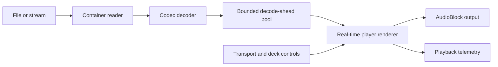
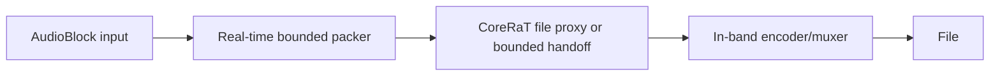

# Media Playback, Recording, and Device I/O

## Purpose

This document defines the architecture for audio-file players, codec-aware file sinks, and live audio-device adapters. It is normative for ownership and real-time boundaries; individual codec and device choices remain incremental implementation decisions.

MusicRaT does not expose compressed packets as graph audio. Files and devices terminate in adapter modules, while the graph carries `AudioBlock`, transport, control, and telemetry messages.

## Processing Boundary

Media playback is split into preparation and rendering:

The reader and decoder run in-band and may perform file I/O, allocate codec state, parse metadata, and fill a bounded pool of decoded planar PCM chunks. The real-time renderer acquires fixed pool slots atomically and performs sample conversion, interpolation, channel mapping, fades, and timeline accounting only.

A decoder is never called directly from `process()`. A cache miss produces deterministic silence or a held/faded sample according to policy, sets `AUDIO_BLOCK_UNDERRUN`, and increments telemetry; it never falls back to synchronous decoding.

The initial `VarispeedRenderer` uses the silence policy. Graph time and output sequence continue during starvation, while media position stalls until a matching decoded chunk is available. A transport-following coordinator may instead request a generation-safe seek when the accumulated sync error exceeds its correction threshold.

## Decoder Contract

A codec backend owns both container demuxing and elementary-stream decoding when the selected library combines them. Its non-real-time interface must support:

- Probe/open from a path or prepared stream.
- Report codec, duration when known, native sample rate, channel layout, and seek capability.
- Decode bounded planar PCM chunks into caller-owned or pool-owned storage.
- Seek to a media-frame position and report the actual decoded start position.
- Flush codec delay and stale packets after seek.
- Distinguish end-of-stream, recoverable starvation, malformed input, unsupported format, and fatal I/O errors.
- Close without requiring the real-time thread.

Decoded chunks carry media-frame start position, frame count, channel count, sample rate, generation, discontinuity flags, and PCM data. The initial pool may use the application `AudioBlock` capacities, but decoded storage is an internal backend type rather than a CommRaT wire message.

Codec libraries are optional backend dependencies. The first implementation order is:

1. PCM WAV using an internal deterministic reader.
2. FLAC for lossless library-backed decoding and golden tests.
3. MP3 and AAC for common performance media.
4. Opus for network-oriented and low-latency assets.

No public module type is named after a third-party codec library. Unsupported codecs fail during prepare/open and are reported through bounded status telemetry.

`DecoderBackend` is the implemented compile-time contract for these operations. `DecodeAhead<Decoder, ChunkCount>` owns any conforming decoder and feeds the common preallocated pool; codec code is therefore absent from the renderer and real-time coordinator. The contract is validated independently with an in-memory decoder.

Each backend reports a stable `DecodeError` category for its most recent failed operation: invalid argument, file open or I/O failure, unsupported format, invalid metadata, resource exhaustion, seek failure, corrupt data, backend failure, or pool publication failure. Codec-native failures are normalized at the backend boundary so `PlaybackStatusBlock` remains independent of optional library ABIs. A successful open, seek, or decode clears the previous error.

`WavReader` accepts PCM16 RIFF/WAVE, traverses padded unknown chunks, reports fixed stream metadata, decodes into caller-owned bounded `AudioBlock` storage, and supports frame seeks with a discontinuity marker. `FlacReader` uses optional libFLAC stream decoding with all file reads and seeks routed through `corerat::File`. It keeps one decoded FLAC frame in fixed storage and rejects streams whose declared maximum block size exceeds `AudioBlock::MAX_FRAMES`; libFLAC allocation and codec work remain on the player worker. `MUSICRAT_FLAC_SUPPORT` accepts `AUTO`, `ON`, or `OFF`: `AUTO` enables the backend when pkg-config finds libFLAC, while `ON` makes its absence a configuration error.

`Mp3Reader` uses optional libmpg123 decoding with caller-owned read and seek callbacks backed by `corerat::File`. Open performs a worker-side scan to establish duration and a seek index, fixes output to native-rate signed PCM16 mono or stereo, and converts interleaved samples into bounded planar storage. Decoder allocation, scanning, seeking, and compressed-file I/O remain on the player worker. `MUSICRAT_MP3_SUPPORT` accepts `AUTO`, `ON`, or `OFF` with the same optional-dependency semantics; Debian-family systems provide the pkg-config dependency through `libmpg123-dev`.

`DecoderDispatcher<Backends...>` probes registered backends in order and exposes the selected backend through the same `DecoderBackend` contract. `MediaDecoder` conditionally registers `FlacReader` and `Mp3Reader`, followed by the always-available `WavReader`. Additional formats extend that registry without changing the player or renderer.

## Decode-Ahead and Handoff

The decode-ahead pool has fixed capacities selected before playback starts:

- Chunk frame capacity.
- Chunk count and maximum channel count.
- Low/high refill watermarks.
- Maximum seek/preroll window.

Ownership transfers through a bounded single-producer/single-consumer index queue or an equivalent proven CoreRaT primitive. PCM buffers themselves remain preallocated and are recycled; they are not copied into an unbounded queue.

The worker may block waiting for free chunks. The renderer never blocks waiting for decoded data. Queue saturation, starvation, discarded stale chunks, and decode errors are observable telemetry.

The pool reports a generation-filtered half-open buffered envelope `[buffered_start_frame, buffered_end_frame)`. It includes ready chunks and chunks currently held by the renderer, so loop-pinned audio remains visible. The envelope is empty when both values are zero. Because it is an envelope over a fixed pool rather than a list of intervals, it may span gaps after nonsequential retention.

Every load or seek increments a generation. The renderer rejects chunks from older generations. This prevents pre-seek audio from leaking after an asynchronous seek without requiring a queue clear on the real-time thread.

`PlaybackCoordinator<Decoder, ChunkCount>` owns the format-neutral decode-ahead and rendering sides of this boundary while leaving worker scheduling to its caller. `WavPlaybackCoordinator` is the PCM WAV alias. Worker-side open, seek, close, and refill methods never run on the audio thread. A lock-free versioned snapshot publishes generation, target media frame, and channel count. While that snapshot is changing, the audio side releases old leases and emits bounded underrun silence; after publication it adopts the new generation at the next render boundary. Rejected seeks preserve the current generation and media position.

## Player Timeline and Controls

A player tracks two positions:

- **Media position:** source frames on the decoded asset timeline.
- **Render position:** frames emitted on the graph clock timeline.

The public player parameters are persistent defaults. Timestamped deck and transport changes use bounded streaming events; discrete prepare/load operations use commands.

Required deck operations are:

- Play, pause, stop, and return to cue.
- Absolute seek and bounded relative seek.
- Set/clear cue point.
- Set, enable, and disable a loop.
- Playback rate and direction.
- Pitch-lock mode.
- Master/follower sync selection and phase nudge.

Loading a path is an imperative command because it may fail and requires preparation. The command schedules in-band loading and replies with accepted/rejected state; readiness is reported separately when decoding has reached the required watermark.

### Playback Rate

Rate has two explicit modes:

- **Varispeed:** resampling changes tempo and pitch together. Source advance is `rate` media frames per nominal output frame after sample-rate conversion.
- **Pitch lock:** a time-stretch engine changes tempo while preserving pitch, with documented algorithmic latency and supported rate range.

The player implements pitch lock as an optional Rubber Band 3 real-time stage after varispeed rendering. Varispeed controls source advance and graph timing; Rubber Band applies the inverse pitch scale at unity time ratio. The R2 engine runs single-threaded with a short window, dynamic-pitch consistency, a fixed maximum process size, and fixed MusicRaT conversion buffers. Construction, configuration, and start padding occur before normal rendering. The supported pitch-lock rate range is `0.5..2.0`; plain varispeed remains `0.25..4.0`. `MUSICRAT_RUBBERBAND_SUPPORT` accepts `AUTO`, `ON`, or `OFF` and the dependency is GPL-2+.

Pitch-lock latency is the Rubber Band start delay for the selected configuration and is published as `algorithmic_latency_frames`. Real-time start padding and delay trimming preserve stream alignment; output not yet available is explicit underrun silence. Discontinuities reset the pitch processor before the affected block. The varispeed renderer writes the effective rate for every output frame into caller-owned fixed storage. The pitch processor consumes contiguous equal-rate segments from that trace, so immediate changes begin at their declared sample offset and ramps update the inverse pitch scale for every rendered frame. Rate events outside the active pitch-lock range are rejected before they alter media position.

Reverse playback requires reverse-capable decode-ahead and is a separate milestone; it must not imply arbitrary backwards operation for every codec.

Rate, nudge, and pitch changes are smoothed. Values outside the backend's declared range are rejected during configuration or clamped according to explicit parameter metadata.

The allocation-free `VarispeedRenderer` consumes a bounded span of decoded chunk views, rejects stale generations, uses absolute media-frame position, interpolates across chunk boundaries, performs sample-rate conversion, and emits a complete requested graph quantum. `DecodeAheadRenderer` retains unread pool leases across calls and releases only fully consumed chunks. Pause and decode starvation emit silence without advancing media position; end-of-stream and unavailable-data frames are explicitly flagged.

`DeckControlEventBlock` carries bounded, sample-offset play, pause, immediate-rate, ramped-rate, cue, and loop events. These events are applied inside the render loop, including during decode starvation, so graph-time controls update deck state without advancing the stalled media timeline. Cue returns and loops are accepted only when their source frames are resident in the fixed decode-ahead window. An enabled loop pins overlapping pool leases and uses a half-open `[start, end)` range; wraps and cue returns mark the audio and playback-status blocks discontinuous. Controls outside the resident window are rejected without changing media position. Load and arbitrary seek remain worker-owned operations because they change decoder state and generation.

### Beat and Transport Sync

Beat-grid analysis is prepared off the real-time thread or loaded from session metadata. A beat grid contains a stable origin, tempo segments, meter, confidence, and optional downbeat markers.

A synchronized player consumes the graph `TransportBlock` and maps transport position to media position. Sync has independent controls for:

- Tempo matching.
- Beat-phase alignment.
- Bar/downbeat alignment.
- Quantized cue, loop, and start actions.

One transport source is the graph master. Decks are followers and must not silently compete for clock ownership. Manual pitch bend/nudge temporarily offsets phase without rewriting the persisted beat grid. Large corrections use a discontinuity/seek; small corrections use a bounded rate adjustment.

`MusicRaTTransportSource` is the launchable graph master. It publishes a deterministic position from its configured period, tempo, sample rate, meter, and play state. `MusicRaTAudioFilePlayer` accepts its `TransportBlock` as a second optional synchronized input. Tempo mode follows master tempo; beat and bar modes additionally apply bounded phase nudges, while discontinuities and phase errors beyond the threshold enqueue generation-safe worker seeks. Explicit deck controls are applied after transport decisions within a render block. Sync mode, beat positions, phase error, following state, and pending seeks are included in playback telemetry.

Deck events may request immediate, next-beat, or next-bar execution. A bounded quantizer converts due actions into the renderer's existing sample-offset controls and retains future actions in fixed storage; pending actions are cleared across subsequent media generations so stale cue or loop operations cannot leak across loads and seeks. Quantized play, cue return, and loop enable use the same allocation-free renderer path as immediate controls. Playback telemetry reports pending and dropped quantized actions plus received deck-control and transport block counts.

Timer-driven CommRaT modules fetch synchronized inputs against the timer-loop timestamp. Unrouted trailing synchronized inputs remain invalid, preserving compatibility with player graphs that route deck controls without transport. The process launcher starts modules with synchronized dependencies after their producers.
- Synchronized inputs: optional `DeckControlEventBlock` and `TransportBlock`.
`MusicRaTDeckControlSource`, `MusicRaTTransportSource`, `audio_file_player_to_wav.json`, `audio_file_player_transport_sync_to_wav.json`, `audio_file_player_quantized_start_to_wav.json`, `audio_file_player_flac_to_wav.json`, `audio_file_player_mp3_to_wav.json`, and `audio_file_player_pitch_lock_to_wav.json` provide complete routed playback examples.

## File Sinks and Encoders

File sinks use the inverse split:

The implemented PCM16 WAV sink packs one complete interleaved block into fixed storage and submits it through `corerat::File`. On EVL, `corerat::File` uses the EVL proxy; header patching, seek, sync, and close occur during non-real-time lifecycle teardown. The CoreRaT STD backend performs direct POSIX I/O and is therefore suitable for offline/tests, not a claimed hard-real-time live recorder.

Compressed sinks require an in-band encoder worker because codec calls are not real-time safe. Their real-time side transfers preallocated PCM chunks through a bounded handoff. Encoder configuration includes codec, container, sample format, channel layout, bitrate/quality, metadata, and overflow policy. File extension is not used as the sole codec selector.

A recording overflow never blocks the audio thread. Policy is explicit: drop newest, drop oldest where ownership permits, or stop recording at the next lifecycle boundary. The sink reports dropped frames and marks discontinuities.

## Live Audio Devices

JACK/PipeWire, ALSA, and future portable backends terminate in dedicated adapter modules. Device callbacks only copy/convert bounded buffers, advance clock state, and update atomic counters.

A live output path must define:

- Device identity and negotiated sample format.
- Hardware and graph sample rates.
- Period size and bounded buffering depth.
- Channel-layout mapping.
- Clock-master ownership.
- Underrun policy and counters.
- Hot-plug and format-change behavior.
- Measured backend and graph latency.

The preferred Linux-first prototype is JACK or PipeWire because the server owns graph timing and device negotiation. Direct ALSA remains useful for appliances and RaTOS targets. Backend selection must not alter DSP or media protocol types.

Full duplex shares one device clock and reports capture/playback timestamp correlation. Independent input and output devices require an explicit drift-compensation policy; nominally equal sample rates are not assumed coherent.

## Module Shapes

### Audio File Player

- Output: `AudioBlock`.
- Synchronized inputs: implemented `DeckControlEventBlock`; future `TransportBlock`.
- Parameters: default path/reference, channel mapping, initial cue, initial rate, pitch-lock mode, loop defaults, decode-ahead sizing within compile-time limits.
- Commands: prepare/load, unload, seek when immediate request/reply is required, and analysis refresh.
- Telemetry: readiness, play state, positions, buffered frames, duration, codec metadata, underruns, decode errors, effective rate, sync error, and algorithmic latency.

The launchable `MusicRaTAudioFilePlayer` is the codec-neutral `Module2` implementation. It runs a private in-band decoder worker, selects a registered decoder through runtime probing, accepts asynchronous load/seek/unload commands on its audio output, consumes sample-offset deck controls, and renders through the generic playback coordinator. Its second output publishes a bounded `PlaybackStatusBlock` synchronized with each audio block. The snapshot reports generation, media-frame position, effective and supported rate range, pitch mode, algorithmic latency, output and source channel counts, source sample rate, codec, duration, resident decoded frames, the buffered source-frame envelope, worker state, the latest typed decode error, readiness/play state, and underrun, end-of-stream, discontinuity, looping, or invalid render state. Metadata is published atomically with its decoder generation; an in-progress or mismatched transition reports `PREPARING` with cleared metadata rather than a mixed snapshot. Worker `END_OF_STREAM` means decoding reached the source end and may coexist with resident frames that are still available to render. Resident frames and the buffered envelope include renderer-held chunks, including chunks pinned by a bounded loop. `MusicRaTDeckControlSource`, `audio_file_player_to_wav.json`, `audio_file_player_flac_to_wav.json`, and `audio_file_player_pitch_lock_to_wav.json` provide complete routed playback examples.

### Encoded File Sink

- Input: `AudioBlock`.
- Parameters: path, expected stream format, codec/container settings, and overflow policy.
- Lifecycle: open/prepare on enable; drain/finalize on disable.
- Telemetry: frames accepted/written/dropped, queue depth, encoder state, and errors.

### Audio Device Adapter

- Audio sink/source ports according to direction.
- Device and format settings in `Params<T>`.
- Start/stop/reopen operations through lifecycle and commands.
- Device timing and health through bounded telemetry.

## Validation

Each codec backend requires deterministic decode tests, malformed/truncated input tests, seek tests, channel/sample-rate coverage, and declared tolerance against a known PCM result. Player tests cover generation changes, starvation, end-of-stream, loops, rate smoothing, discontinuities, and timeline arithmetic independently from CommRaT.

Process-level tests cover descriptor generation, asynchronous prepare, route startup, final file correctness, and router-managed cleanup. Standard-Linux tests validate behavior but do not establish real-time safety. EVL execution in RaTOS QEMU is required for proxy/handoff paths, and physical hardware is required for latency, drift, jitter, and dropout claims.
