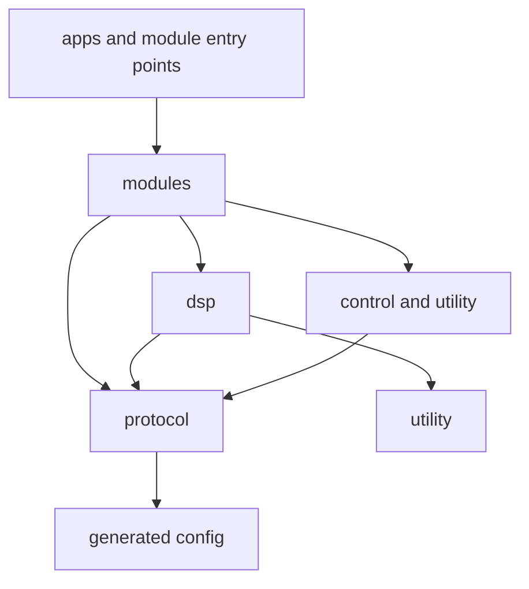

# Project Layout and File Conventions

## Purpose

This document defines where MusicRaT code and assets live. New files must follow this convention so public API boundaries, real-time DSP, CommRaT modules, executable wrappers, tests, and launch projects remain easy to navigate.

## Directory Tree

```text
MusicRaT/
├── CMakeLists.txt
├── ROADMAP.md
├── cmake/                         # Reusable CMake modules when top-level CMake grows
├── docs/                          # Architecture and contributor documentation
├── examples/
│   ├── configs/                   # Complete CommRaT application JSON files
│   └── assets/                    # Small redistributable example audio/MIDI assets
├── include/musicrat/              # Public, installable headers
│   ├── config.hpp.in              # CMake-generated application policy template
│   ├── musicrat.hpp               # Application registry and public umbrella
│   ├── protocol/                  # Serializable messages, commands, params metadata
│   ├── dsp/                       # CommRaT-independent real-time DSP kernels
│   ├── modules/                   # Public CommRaT Module2 implementations
│   ├── control/                   # Shared control mapping and event utilities
│   └── utility/                   # Small general real-time-safe helpers
├── src/                           # Private translation units and executable wrappers
│   ├── apps/                      # Launchers, offline tools, and future GUI executables
│   ├── modules/                   # COMMRAT_MODULE_MAIN wrappers, one per binary
│   ├── backends/                  # Audio/MIDI/HID/OSC platform implementations
│   └── internal/                  # Non-public implementation details
└── tests/
    ├── protocol/                  # Serialization and message-contract tests
    ├── dsp/                       # Kernel tests without CommRaT threads
    ├── modules/                   # Module behavior and lifecycle tests
    ├── integration/               # Launcher and multi-process graph tests
    └── fixtures/                  # Small deterministic test assets/configs
```

Directories are created when their first real file is added; empty placeholder directories are not required.

`APPLICATION_DESIGNER.md` owns the user-facing project designer, control-surface,
RatGUI/LVGL, hardware binding, and presentation contracts. `SIGNALS_AND_PORTS.md`
owns the underlying typed data-flow and launcher contracts.

## Public Include Convention

Every public header lives below `include/musicrat/` and is included with its installed path:

```cpp
#include <musicrat/protocol/audio_block.hpp>
#include <musicrat/dsp/gain.hpp>
#include <musicrat/modules/gain.hpp>
#include <musicrat/musicrat.hpp>
```

Do not add headers directly under `include/`. Do not use relative parent paths or include public headers as `"gain.hpp"`. This keeps source-tree and installed-package builds equivalent.

`musicrat/config.hpp` is generated into the build include tree from `include/musicrat/config.hpp.in`. Source headers include it using the same installed path.

## Dependency Direction

Dependencies flow downward only:



- `protocol/` may depend on generated configuration, SeRTial, and standard-library bounded types. It must not include MusicRaT modules.
- `dsp/` contains allocation-free kernels and block processors. Scalar kernels avoid message containers; block processors may depend on `protocol/` and `utility/`. DSP must not depend on CommRaT, launcher configuration, GUI code, device APIs, or filesystem I/O.
- `modules/` adapts protocol and DSP code to `MusicRaT::Module2`.
- `control/` contains semantic event mapping and parameter dispatch shared by modules.
- `src/backends/` owns platform APIs and protocol parsing; public backend interfaces may live under `include/musicrat/backends/` only when consumers need them.
- Media container/codec implementations live under `src/backends/media/`; their public non-real-time interfaces may live under `include/musicrat/backends/media/`. Real-time playback kernels remain under `dsp/`.
- Decoder adapters implement `backends/media/decoder.hpp`; format-neutral decode-ahead and playback coordination remain templated over that contract.
- `src/modules/` files contain only the minimal type alias and `COMMRAT_MODULE_MAIN` needed to produce one launchable binary.
- `src/apps/` composes process-level tools and must not contain reusable DSP.

Cycles between these layers are not allowed.

## Domain Placement

### Protocol

Serializable wire contracts are grouped by domain, not by producing module:

```text
include/musicrat/protocol/audio_block.hpp
include/musicrat/protocol/control_events.hpp
include/musicrat/protocol/note_events.hpp
include/musicrat/protocol/transport.hpp
include/musicrat/protocol/telemetry.hpp
```

Module-specific parameter aggregates and commands may share a focused protocol header such as `protocol/oscillator.hpp` until a domain-wide parameter metadata abstraction exists.

### DSP

Each reusable DSP concept gets a focused header and matching test:

```text
include/musicrat/dsp/gain.hpp
include/musicrat/dsp/gain_processor.hpp
include/musicrat/dsp/biquad.hpp
include/musicrat/dsp/envelope_follower.hpp
tests/dsp/gain_test.cpp
tests/dsp/biquad_test.cpp
```

Keep scalar kernels independent from message containers. A block processor may compose a scalar kernel with protocol validation and metadata handling when that creates a deterministic unit below the CommRaT module boundary.

### Modules

Public module classes use the same basename as their main responsibility:

```text
include/musicrat/modules/gain.hpp
include/musicrat/modules/mixer.hpp
include/musicrat/modules/sine_oscillator.hpp
include/musicrat/modules/audio_file_player.hpp
include/musicrat/modules/null_sink.hpp
```

Launchable wrappers mirror module names:

```text
src/modules/gain_main.cpp
src/modules/mixer_main.cpp
src/modules/sine_oscillator_main.cpp
src/modules/audio_file_player_main.cpp
src/modules/null_sink_main.cpp
```

When several binaries instantiate one template with different policies, each wrapper has a distinct descriptive name while sharing the public implementation header.

### Backends

Backends are organized by subsystem and platform:

```text
src/backends/audio/jack_audio.cpp
src/backends/audio/alsa_audio.cpp
src/backends/media/wav_decoder.cpp
src/backends/media/ffmpeg_decoder.cpp
src/backends/midi/alsa_sequencer.cpp
src/backends/control/osc.cpp
src/backends/control/hid.cpp
```

Device-specific code terminates in adapter modules and emits semantic MusicRaT protocol types.

## Tests and Examples

Tests mirror the ownership boundary of the code under test. A test belongs in the narrowest applicable folder:

- `tests/protocol/`: serialization, capacities, and wire invariants.
- `tests/dsp/`: numerical kernels and boundary values without module threads.
- `tests/modules/`: parameters, processing, reset, lifecycle, and metadata behavior.
- `tests/integration/`: descriptors, launcher routing, and multi-process flows.

Example application configs use descriptive snake-case filenames under `examples/configs/`. Each config represents a complete runnable project and is referenced by at least one integration test or documented hardware prerequisite.

## Naming Rules

- Paths and filenames use lowercase `snake_case`.
- C++ types use `PascalCase`; functions and variables follow the local existing style.
- Public headers use `.hpp`; implementation files use `.cpp`; generated templates use `.in`.
- Launchable CMake targets use `musicrat_<purpose>`.
- Module descriptor class names use `MusicRaT<Purpose>`, for example `MusicRaTGain`.
- Tests use `<subject>_test.cpp` and CTest names use `musicrat.<layer>.<subject>`.
- Application JSON uses stable human-readable instance names such as `Gain_1`.

## CMake Ownership

`musicrat_core` is the shared interface target for public include paths, the generated configuration header, CommRaT, and SeRTial. Every module and test links it rather than repeating include paths.

The top-level `CMakeLists.txt` may list the first few targets. As each area grows, move target declarations into matching files such as `src/modules/CMakeLists.txt` and `tests/CMakeLists.txt`; do not create this split before it removes meaningful clutter.

Public installation will eventually install `include/musicrat/`, the generated `musicrat/config.hpp`, exported CMake targets, descriptors, and selected example configs. Private `src/` headers are never installed.

EVL CMake presets and helper scripts belong in MusicRaT, while ISAR package and image recipes belong in RaTOS. Do not copy RaTOS recipes or SDK contents into this repository. See [EVL and RaTOS Integration](EVL_AND_RATOS.md) for the validation and packaging boundary.

## Adding a Module

A complete new processing module normally adds:

1. Protocol definitions under `include/musicrat/protocol/` if it introduces messages, parameters, or commands.
2. A CommRaT-independent kernel under `include/musicrat/dsp/` with a focused DSP test.
3. A `Module2` adapter under `include/musicrat/modules/` with a module test.
4. A minimal entry point under `src/modules/` and a `commrat_module()` target.
5. A complete application JSON under `examples/configs/`.
6. Descriptor and launcher coverage under `tests/integration/`.
7. Architecture/roadmap updates when the module changes a shared contract.