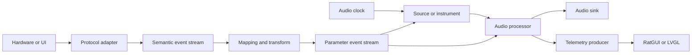

# Signals, Ports, and Graph Architecture

## 1. Purpose and Status

This document is the normative architecture for MusicRaT data flow, control flow, and launcher configuration. [Application Designer, Control Surfaces, and Presentation Architecture](APPLICATION_DESIGNER.md) defines the shared RatGUI/LVGL, hardware-control, binding, and user-facing application-design model. Implementations should follow both unless a later decision explicitly updates them.

Status terms used here:

- **Implemented:** available and validated in the repository.
- **Planned:** the intended contract; code and schema may not exist yet.
- **Open:** a focused prototype or CommRaT extension is required before the contract is final.

The first GUI will edit startup-time graphs. Live topology changes are deferred until an atomic runtime graph-reconfiguration protocol exists.

## 2. Core Model

A MusicRaT project is a directed graph of independently launchable CommRaT module instances. Connections carry typed messages; module parameters and commands are not direct C++ calls.



### 2.1 Graph Terms

- **Module class:** a compiled C++ `Module2` type described by a generated `*.module.json` file.
- **Module instance:** one configured occurrence of a module class in an application JSON file.
- **Physical port:** a typed CommRaT `Output<T>`, `Input<T>`, `SyncedInput<T>`, or `Remote<T>` declared by the module class.
- **Virtual parameter port:** a RatGUI-visible parameter target backed by one module parameter descriptor. Virtual ports compile into events on a shared physical parameter-event input.
- **Route:** a connection from one physical output address to a compatible physical input.
- **Binding:** a persistent mapping from a control endpoint to a virtual parameter port, including transforms and feedback behavior.
- **Project:** the application JSON plus referenced presets/assets. The JSON is authoritative; RatGUI is an editor and launcher for it.

## 3. CommRaT Mapping

MusicRaT uses current CommRaT primitives directly:

| MusicRaT concept | CommRaT representation | Semantics |
| --- | --- | --- |
| Streaming output | `Output<T>` | Publishes a typed sequence to subscribers |
| Driving input | `Input<T>` | Blocks for new data and triggers `process()` |
| Time-correlated secondary input | `SyncedInput<T>` | Fetches data near the primary input timestamp |
| Timer-driven source | `Period<D>` | Triggers `process()` without a driving input |
| Persistent settings | `Params<T>` | Startup JSON plus CommRaT parameter RPC |
| Imperative operation | `DataWithCommands` | Associates typed request/reply commands with an output |
| Command-only dependency | `Remote<T>` | Targets commands and lifecycle operations without a data subscription |
| External process | `companions` | Starts RatGUI or another non-module process with the project path |

`Module2` permits one driving `Input<T>` or one `Period<D>`. Additional time-correlated inputs use `SyncedInput<T>`. This constraint determines the module patterns below.

## 4. Port Domains

Port domains remain separate even when payloads contain similar primitive values. RatGUI must reject incompatible connections before writing a launch config.

| Domain | Payload family | Typical rate | Purpose |
| --- | --- | --- | --- |
| Audio | `AudioBlock` | Every audio quantum | PCM audio and stream timing |
| Process clock | `ProcessContext` | Every audio quantum | Drives generators that have no audio input |
| Raw control | `ControlEventBlock` | Event-driven or batched | Device-independent knobs, encoders, switches, gates, and triggers |
| Parameter control | `ParameterEventBlock` | Block-aligned | Values mapped to parameters of one target module |
| Parameter state | `ParameterStateBlock` | On change or bounded snapshot | Authoritative parameter values and feedback provenance |
| Notes | `NoteEventBlock` | Block-aligned | Notes and per-note expression |
| Transport | `TransportBlock` | Block-aligned and on change | Tempo, meter, play state, and musical position |
| Telemetry | Type-specific snapshots | Decimated | Meters, scopes, spectra, health, and diagnostics |
| Commands | Output-associated request/reply types | Sporadic | Reset, preset/resource operations, and device actions |

Compressed media packets and device-native buffers are backend details, not graph port domains. File players decode ahead and publish `AudioBlock`; file/device sinks consume `AudioBlock`. See [Media Playback, Recording, and Device I/O](MEDIA_PLAYBACK.md).

`AudioBlock`, `ControlEventBlock`, the numeric `ParameterEventBlock`,
`ParameterStateBlock`, note, transport, playback-status, and level-meter
payloads are implemented. Future payload families must use bounded serializable
storage.

### 4.1 Compatibility Rules

1. Physical routes require an exact payload-type match.
2. Audio connects only to audio ports with compatible format constraints.
3. Raw controls connect to mapping modules, not directly to arbitrary DSP data inputs.
4. Parameter events connect only to the target module's parameter-event input.
5. Note events connect only to note-aware modules.
6. Transport connects only to modules declaring transport awareness.
7. Telemetry is read-only and must never drive DSP behavior.
8. Commands use `Remote<T>` or a GUI command endpoint and are not represented as streaming cables.

## 5. Audio Domain

### 5.1 `AudioBlock` (Implemented)

`AudioBlock` is planar and bounded by the generated CMake policy. Its metadata is:

| Field | Meaning |
| --- | --- |
| `sample_rate_hz` | Sample rate for all active channels |
| `timestamp_ns` | Time of frame zero on the shared monotonic timeline |
| `sequence_number` | Producer-local monotonic block sequence |
| `frame_count` | Valid frames in every active channel |
| `channel_count` | Number of active channels |
| `flags` | Stream-state flags; definitions are planned |

For a valid block:

- `0 < channel_count <= max_audio_channels`.
- `0 < frame_count <= max_audio_frames` during normal streaming.
- Every active channel has exactly `frame_count` samples.
- Every inactive channel is empty.
- All channels share one sample rate and timestamp.

Processors preserve format, timestamp, sequence, and applicable flags unless their documented behavior changes them. A processor that changes latency reports it separately and adjusts timestamps only according to the future latency contract.

### 5.2 `ProcessContext` (Planned)

Generators need an audio-timeline driver even when no note or control event occurs. `ProcessContext` will contain at least:

- Sample rate
- Requested frame count
- Timestamp of frame zero
- Quantum sequence number
- Transport state reference or snapshot
- Discontinuity/reset flags

The initial oscillator uses `Period<>` as a bootstrap implementation. Hardware-backed and offline graphs should eventually derive `ProcessContext` from the graph's clock master so every generator emits the requested quantum.

### 5.3 Processor Shapes

| Module kind | Driving input | Synchronized inputs | Outputs |
| --- | --- | --- | --- |
| Generator/instrument | `ProcessContext` | Notes, parameters, transport | `AudioBlock` |
| Simple processor | `AudioBlock` | Parameters, sidechain metadata | `AudioBlock` |
| Mixer | Primary `AudioBlock` | Additional `AudioBlock`s, parameters | `AudioBlock` |
| Analyzer | `AudioBlock` | Optional settings | Telemetry snapshots |
| Audio sink | `AudioBlock` | Optional device state | None or telemetry |
| Audio device clock | Backend-driven/loop | Rendered `AudioBlock` | `ProcessContext`, telemetry |

The audio-device clock shape is **open** because callback timing, cross-process IPC, and CommRaT synchronization must be prototyped before it becomes normative.

## 6. Control Domain

### 6.1 Parameter Classes

Parameters fall into three categories:

- **Configuration:** changed rarely and not automated, such as device selection or maximum voice count. Use `Params<T>` RPC and project JSON.
- **Real-time parameter:** gain, cutoff, pan, and similar values. Defaults live in `Params<T>`; live changes arrive through `ParameterEventBlock` and are smoothed at the target.
- **Action:** reset, clear, load prepared resource, or trigger capture. Use an output-associated command with an explicit reply.

Do not send high-rate automation through JSON parameter RPC. Do not model persistent settings as trigger events.

### 6.2 Parameter Metadata (Initial Implementation)

CommRaT exposes parameter names, C++ types, current JSON values, and descriptor defaults. MusicRaT adds schema-versioned metadata for GUI-controllable parameters:

- Stable numeric ID and canonical string name
- Display name and group
- Value kind: continuous, integer, boolean, choice, or text
- Native unit and display unit
- Minimum, maximum, and step; the default remains in `params_defaults`
- Linear, logarithmic, or decibel display mapping
- Automatable/read-only flags
- Optional enum labels

The canonical string name is persisted in project JSON for readability. A bounded numeric ID is carried in real-time events. MusicRaT launcher preflight rejects duplicate IDs and names, names absent from `params_defaults`, invalid ranges, and malformed choices. Launchable modules publish their flat startup parameters; structured aggregates require a dedicated editor contract. Frequency/custom mappings and explicit smoothing policy remain planned.

### 6.3 Runtime Control IDs

Project files persist readable string IDs for devices, endpoints, origins, and
bindings. Launch preparation resolves them to globally unique, session-stable
`uint32_t` IDs before any real-time processing starts. Zero is reserved for an
unspecified ID. Real-time messages never carry project strings or allocate ID
storage.

The Application Designer allocates IDs deterministically by lexicographically
sorting owner IDs, owner/endpoint pairs, and binding IDs, then numbering each
set from one. The resulting table is reproducible for an unchanged project and
is supplied to generated mapper and adapter configuration rather than inferred
in the audio thread.

An origin identifies the causal gesture or externally initiated update and is
preserved through mapping and feedback. A binding identifies the persistent
mapping selected for an event. These IDs are deliberately separate because one
origin may affect several bindings and one binding may receive many origins.

### 6.4 `ControlEventBlock` (Implemented)

Adapter modules translate MIDI, HID, OSC, GPIO, computer keyboard, and other protocols into bounded semantic control events. Each event contains:

- Stable source device and endpoint IDs
- Origin ID for causal tracking and feedback-loop suppression
- Event kind: unipolar, bipolar, relative, boolean, choice, gate, or trigger
- Normalized value or relative delta
- Sample offset within the destination quantum
- Gesture flags such as begin, update, end, and cancellation

The block is bounded by `max_control_events` and carries a source timestamp,
sequence number, and overflow flag. Events use `double` values so mapping into
numeric parameter values does not introduce a protocol precision change. No
device-specific packet representation crosses this boundary.

### 6.5 `ParameterEventBlock` (Implemented Numeric Contract)

A mapping module transforms raw controls into target-oriented events. Each event contains:

- Target parameter ID
- Numeric value in the target parameter's declared domain
- Sample offset within the target audio quantum
- Source endpoint ID
- Origin ID preserved from the initiating control or automation source
- Binding ID selected by the mapping engine

The mapping kernel orders output by sample offset and preserves binding
declaration order for equal offsets. When the output reaches capacity,
additional mapped values are dropped, the overflow flag is set, and binding
state is not advanced for changes the target did not receive. The source-
overflow flag preserves an upstream `ControlEventBlock` overflow indication.
Target coalescing remains planned.

The bounded block carries timestamp and sequence metadata. Gain and stereo pan
consume ordered, in-range numeric events. Typed discrete values, change flags,
coalescing, and overflow telemetry remain planned.

### 6.6 `ParameterStateBlock` (Implemented)

Targets publish authoritative numeric state through a bounded feedback block.
Each state contains the parameter ID, originating endpoint ID, origin ID,
binding ID, and current value. The block carries timestamp and sequence
metadata plus overflow and snapshot flags. The producing CommRaT route
identifies the module instance, so the payload does not duplicate a launcher
address.

Adapters suppress reflexive feedback by comparing origin IDs while still
accepting state from other origins. Binding IDs route the state to the selected
feedback destination. A snapshot flag identifies a requested current-state
projection; an unflagged block is an incremental update.

### 6.7 Headless Mapping Kernel (Implemented)

`musicrat::dsp::ControlMapper` is independent of CommRaT module lifecycle,
device protocols, and GUI frameworks. Configuration compiles persistent
bindings into fixed-capacity records containing numeric IDs, source kind and
range, target parameter and range, mapping mode, curve, affine transform,
dead-zone, quantization, hysteresis, pickup policy, and initial value.

Configuration rejects zero IDs, duplicate binding IDs, invalid ranges, unknown
kinds or modes, non-finite values, and excess bindings before processing.
Processing performs no allocation, locking, or throwing operations. It supports
absolute, relative, toggle, momentary, gate, trigger, and choice mappings.
Absolute values are normalized, optionally inverted, dead-zone and curve
transformed, scaled and offset, mapped into the target range, quantized, and
clamped. Relative values accumulate from authoritative state. Hysteresis
suppresses insignificant output changes.

`ParameterStateBlock` updates resynchronize binding state. Match pickup is
re-armed by synchronization and emits only after the physical control reaches
or crosses the authoritative value; immediate pickup applies the next event.

`MusicRaTControlMapper` is the launchable adapter around this kernel. It has one
`Input<ControlEventBlock>`, one optional synchronized
`ParameterStateBlock` input, one `Output<ParameterEventBlock>`, and bounded
compiled bindings in `Params<ControlMapper>`. Invalid startup or updated
configuration produces an empty block with `PARAMETER_EVENT_BLOCK_INVALID_CONFIG`.

### 6.8 Virtual Parameter Ports

RatGUI may draw one input pin per parameter, but modules should not declare one CommRaT message type or mailbox per knob. Instead:

1. The GUI reads parameter metadata from the module descriptor.
2. It displays selected parameters as virtual ports.
3. A connection creates a binding with a target parameter ID.
4. Mapping modules emit all target changes through one bounded `ParameterEventBlock` output.
5. The target module receives one `SyncedInput<ParameterEventBlock>` and dispatches events by parameter ID.

This preserves discoverability without causing message-registry or mailbox growth.

### 6.9 Bindings

A binding is project data and includes:

- Stable binding ID
- Source device and endpoint identity
- Target module instance and parameter name/ID
- Input mode: absolute, relative, toggle, momentary, trigger, or increment/decrement
- Scale, offset, inversion, dead zone, curve, quantization, and hysteresis
- Pickup/soft-takeover mode
- Optional channel, bank, page, or modifier conditions
- Arbitration priority when multiple bindings target one parameter
- Optional feedback route for LEDs, displays, and motorized controls

Feedback must carry an origin/binding identifier or equivalent suppression state so a returned device update cannot create a loop.

## 7. Note Domain

### 7.1 `NoteEventBlock`

Notes remain separate from generic controls. The bounded event set supports:

- Note on and note off
- Velocity and release velocity
- Channel and stable note identity
- Polyphonic pressure and per-note pitch/timbre expression
- Sample offset within the target quantum
- Source endpoint and sequence identity

The MIDI adapter converts MIDI 1.0 messages into this model. MIDI 2.0, computer keyboard, sequencers, and other sources produce the same semantic events.

The core note contract is independent of MusicXML and raw MIDI encoding. MIDI parsing, running status, device timestamps, and channel filtering belong to backend adapter modules; instruments consume only `NoteEventBlock`. MusicXML conversion remains a separate, later producer of the same events.

Lossless note-edge delivery is mandatory. A latest-value snapshot is insufficient because a note-on and note-off may occur in one quantum. The event scheduler must batch every edge for the target interval or report overflow explicitly.

## 8. Transport Domain

`TransportBlock` is planned to carry:

- Playing, paused, stopped, recording, and looping state
- Monotonic frame position
- Musical beat/bar position
- Tempo and time signature
- Loop bounds
- Discontinuity, seek, and clock-source flags

Transport state is block-aligned. Abrupt changes are represented as timestamped events within the block when sample accuracy matters.

## 9. Telemetry Domain

Telemetry uses dedicated bounded message types rather than `AudioBlock` copies where possible:

- Peak/RMS/clip meter snapshots
- Decimated oscilloscope data
- Spectrum bins computed outside the audio callback
- Filter/EQ response curves
- Compressor envelope and gain reduction
- Module health, queue depth, drop count, underrun/overrun count, and processing time
- Device discovery and connection state

Telemetry publication is rate-limited and lossy by design. Dropping stale GUI frames is preferable to delaying audio processing. RatGUI subscribes to telemetry but never mutates module state through telemetry channels.

`LevelMeterBlock` is the first implemented telemetry type. It contains fixed per-channel arrays for sample peak, RMS, and clipping state plus channel count, timestamp, sequence number, and flags. `MusicRaTLevelMeter` is a pass-through analyzer with output 0 as `AudioBlock` and output 1 as `LevelMeterBlock`; this descriptor order is part of its launch-config contract. The initial module publishes one snapshot per audio block. Configurable decimation and true-peak measurement remain planned.

## 10. Timing and Synchronization

All real-time stream payloads use the same monotonic nanosecond clock as CommRaT/TiMS.

- `timestamp_ns` identifies the start of a block or event window.
- A sample offset satisfies `0 <= offset < frame_count`.
- A module's driving input defines the timestamp used to fetch synchronized inputs.
- Event producers must prepare block-aligned event batches early enough for consumers to fetch them.
- Sequence gaps indicate dropped blocks independently of timestamp discontinuities.
- Late, duplicate, and out-of-order events follow explicit per-domain policies and update telemetry counters.

Before sample-accurate control is implemented, a prototype must verify CommRaT `SyncedInput<T>` behavior for event windows under scheduler jitter. Until then, parameter RPC is suitable for UI editing but not promised to be sample-accurate automation.

## 11. Launcher Representation

The CommRaT application JSON is the canonical serialized graph. Generated module descriptors supply the type information that is intentionally absent from each route entry.

An outputless module supplies `module_address` in its application entry. This is its lifecycle and WORK-mailbox identity; it is not a routable data output.

```json
{
  "app_name": "ControlledGain",
  "modules": [
    {
      "name": "Oscillator_1",
      "module_class": "MusicRaTSineOscillator",
      "outputs": [{ "system_id": 10, "instance_id": 1 }],
      "inputs": [],
      "period_ms": 10,
      "params": { "frequency_hz": 440.0, "amplitude": 0.25 }
    },
    {
      "name": "Controller_1",
      "module_class": "MusicRaTControlSource",
      "outputs": [{ "system_id": 20, "instance_id": 1 }],
      "inputs": [],
      "period_ms": 10
    },
    {
      "name": "Gain_1",
      "module_class": "MusicRaTGain",
      "outputs": [{ "system_id": 30, "instance_id": 1 }],
      "inputs": [{ "source_system_id": 10, "source_instance_id": 1 }],
      "synced_inputs": [{ "source_system_id": 20, "source_instance_id": 1 }],
      "params": { "gain_db": 0.0, "ramp_ms": 5.0 }
    },
    {
      "name": "Sink_1",
      "module_class": "MusicRaTNullSink",
      "outputs": [],
      "inputs": [{ "source_system_id": 30, "source_instance_id": 1 }]
    }
  ]
}
```

This is a planned example: the control, gain, and sink classes do not exist yet.

### 11.1 Positional Port Rule

Current CommRaT application arrays are positional:

- `outputs[n]` configures descriptor output `n`.
- `inputs[n]` configures descriptor continuous input `n`.
- `synced_inputs[n]` configures descriptor synchronized input `n`.
- `remotes[n]` configures descriptor remote `n`.

RatGUI must preserve descriptor order when generating JSON. MusicRaT's
`musicrat_ports` metadata maps stable IDs and labels to each exposed descriptor
direction/index, so duplicate payload types remain understandable and
reorder-safe. The payload list itself remains authoritative for compatibility.
Known payloads are cross-checked against their declared domains; in particular,
`NoteEventBlock` inputs are explicit note-domain graph ports.

### 11.2 Graph Compilation by RatGUI

RatGUI generates a launch configuration through these steps:

1. Discover `*.module.json` files and build a module-class catalog.
2. Instantiate selected module classes and retain stable instance IDs.
3. Display physical ports from descriptor I/O types and virtual ports from parameter metadata.
4. Permit only compatible edges and required cardinalities.
5. Allocate non-conflicting system/instance addresses.
6. Serialize physical routes into `inputs` and `synced_inputs` in descriptor order.
7. Serialize command dependencies into `remotes`.
8. Serialize startup settings into `params` and control mappings into binding data.
9. Add RatGUI itself under `companions` when desired.
10. Validate, save atomically, launch, and monitor lifecycle/telemetry endpoints.

RatGUI must round-trip unknown fields so newer modules do not lose configuration when opened by an older GUI.

## 12. Validation Rules

Validation occurs before process startup and is repeated by RatGUI before saving:

- Every module class has a complete descriptor and binary.
- Every required physical input has exactly one source unless its module contract says otherwise.
- Source and destination payload types match exactly.
- Output addresses do not collide for the same payload type.
- Positional config arrays match descriptor cardinality and order.
- All required remotes are present and command-compatible.
- Audio sample rates, channel constraints, frame capacities, and clock domains are compatible.
- Parameter values satisfy type, range, and enum constraints.
- Bindings reference existing devices/endpoints and module parameters; disconnected devices may remain as explicit unresolved bindings.
- Cycles are rejected unless every feedback path contains a module with declared delay.
- Estimated latency and bounded queue capacity satisfy graph policy.

CommRaT owns descriptor discovery and validates typed mailbox addresses, route
cardinality, remotes, and payload identity. It carries optional
`descriptor_metadata` without interpreting application-specific fields and
invokes the validator supplied by `musicrat_launcher` after generic routing
validation.

MusicRaT descriptor metadata declares stable physical ports, virtual parameter
targets, and known audio endpoint format values. Launcher preflight validates
port IDs, positions, domains, cardinality, and parameter schemas before audio
format propagation. The audio validator resolves fixed values and parameter-backed defaults or
instance overrides, then rejects direct audio routes with incompatible sample
rates, channel counts, compile-time capacities, or explicitly declared clock
domains. Modules that preserve audio format declare explicit input-to-output
pass-through relationships. Validation propagates known constraints through
those relationships to a fixed point, so incompatibilities are detected across
processor chains before launch. Gain and level meter currently declare this
relationship. Dynamic formats remain unspecified rather than guessed;
format-changing processors and negotiation with hardware backends remain
planned.

## 13. Runtime Changes

Version 1 uses two update classes:

- Parameter RPC and predeclared streaming control routes may change while running.
- Module creation/removal and physical route changes require stop, regenerate config, and relaunch.

Future live rewiring requires a transaction containing validation, resource preparation, block-boundary activation, rollback, and old-resource retirement. RatGUI must not simulate live rewiring by mutating launcher JSON behind running processes.

## 14. Implementation Sequence

The next vertical slice is normative:

1. Define bounded parameter-control messages and IDs.
2. Implement a deterministic gain DSP kernel.
3. Implement `MusicRaTGain` with `Input<AudioBlock>` and `SyncedInput<ParameterEventBlock>`.
4. Implement `MusicRaTNullSink` with continuity and format counters.
5. Implement a deterministic control source for tests.
6. Add an `oscillator -> gain -> null sink` application JSON with a control route.
7. Test serialization, DSP behavior, descriptor generation, route validation, process startup, and clean shutdown.
8. Prototype synchronized event-window behavior before promising sample-accurate automation.

Filters, EQ, mixer, synthesizer, MIDI, and hardware adapters should be built only after this slice proves the shared contracts.